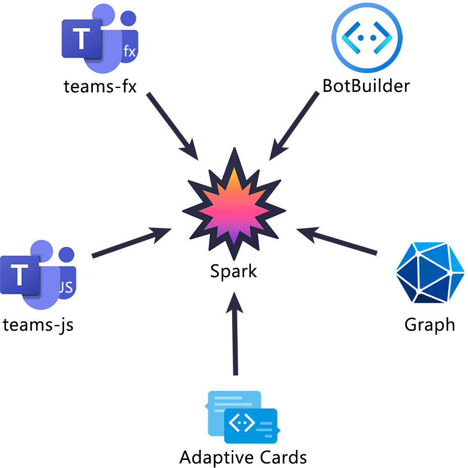

# Why?

Building agents and bots for Microsoft Teams can often involve a lot of boilerplate code and managing numerous dependencies, which can be time-consuming and complex. Our new SDK aims to simplify this process by minimizing the boilerplate and dependencies required, while also providing helpful AI/Teams native abstractions. This allows developers to focus more on creating intelligent and effective bots, rather than getting bogged down in setup and configuration. By streamlining the development process, we hope to make it easier and faster to build powerful, AI-driven bots for Microsoft Teams.

## What Do We Want?

- to easily make bots, and for it to be fun
- to turn those bots into agents

## Teams AI

A step forward in many ways, teams ai reduces boilerplate and adds an improved activity handler syntax over the botbuilder.
It also added ai tooling an an improved auth flow, but there are many things we can learn from and iterate on.

1. Authentication is still really hard
2. Developer experience still isn't there
3. Testing debugging is still really hard
4. Developers want to debug their apps locally
5. Less opinions, less rigid structure of ai system

## Consolidate

Much of the difficulty in our development flow comes from fragmentation of tooling/documentation,
causing information to be hard to find and tools to not feel cohesive with one another.

Today to build a teams app, you may need to use:

- Teams Toolkit as your developer toolchain
- `teams-js` as your package for tab implementation
- `botbuilder-*` or `teams-ai` for package bot implementation
- `teamsfx` for teams utilities
- `adaptivecards` for cards

By combining these tools into one comprehensive suite of tools, we ensure
they all have a similar interface with a cohesive feel.

## Documentation

Today if you try to find the docs on activities or code samples, you will be
guided to our learn docs.

Most of the time they have the information you want, but its difficult to track down due
to their verbosity.

Much of our activity protocol is undocument or not documented enough, leading customers to
not understand what is in the payloads when.

Keeping a clean and concise version of the documentation with easy to use code snippets
is key to a smooth development workflow when onboarding new devs.

## Low Barrier To Entry

Today the process of getting an app up and running minimally has come a long way,
but its still much more difficult than competitors.

With the `@microsoft/teams.cli`/`@microsoft/teams.dev`, the new codebase which is more concise in its syntax,
apps can now be scaffolded and started with one command, and developed locally.

## Developer Tooling

With the Teams Toolkit our developer experience has increased significantly, but it still requires
a lot of configuration boilerplate and doesn't naturally integration with the SDKs it hosts.

With the devtool packages we can integrate our devtooling with the SDK itself, allowing us to create
an easy to use local development flow that requires no boilerplate, just a plugin.

## AI

Going back to the fragmentation, we offer many AI utilities at Microsoft including Semantic Kernel,
AutoGen, and Teams AI. These are great offerings but they are fragmented and don't work well together.
Our customers get confused by which to use and when, which is why we created the `@microsoft/teams.ai` package.

This package integrates well with the other app/bot packages and provides a low opinion interface to work
with LLM's.

## Adaptive Cards

Today we have many adaptive cards designers and libraries. They are once again fragmented which causes confusion.
The new `@microsoft/teams.cards` package provides up to date typings and function implementations for cards to be used
easily, and the `@microsoft/teams.devtools` package provides a designer and testing frontend for developers to easily
build their apps/cards.

## BotBuilder/M365 Agents SDK

This new SDK works with the botbuilder via a plugin in `@microsoft/teams.botbuilder` and it will work with the
M365 Agents SDK when it is released as well. Its important that we provide migration paths for customers
using legacy packages like botbuilder, but that want all the benefits of the new SDK.

This "integration through abstraction" method gives us more flexibility than we have with Teams AI,
and allows us to own our own core typings and activity handling logic, all while still being compatible
with the legacy api.

## Pro Code vs No Code

Both! with the `@microsoft/teams.cli` copilot command, you can use an intelligent agent to help automate
adding/managing features you want to add to your bot.
