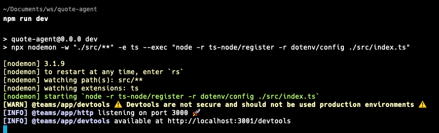
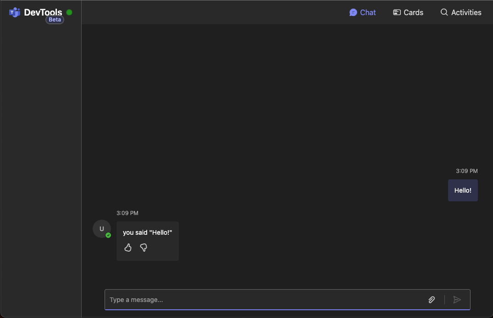

# Your First Application

This guide will walk you through creating your first Teams application using the Teams AI SDK. You'll create a simple echo agent that responds to messages, which serves as a perfect starting point for learning the basics.

## Prerequisites

> [!CAUTION]
> Teams AI SDK requires Node.js version 20 or higher to ensure compatibility with all features. Install or upgrade Node.js from [nodejs.org](https://nodejs.org/).

## Installing the Teams CLI

Install the Teams CLI globally using npm:

```sh
npm install -g @microsoft/teams.cli@latest
```

Alternatively, you can use npx for each command:

```sh
npx @microsoft/teams.cli new <name> ...
```

Verify the installation by running:

```sh
teams --version
```

## Creating Your First Agent

Let's create a simple echo agent that responds to messages. Run:

```sh
teams new quote-agent --template echo
```

This command:

1. Creates a new directory called `quote-agent`
2. Bootstraps the echo agent template files into it

> The `echo` template creates a basic agent that repeats back any message it receives - perfect for learning the fundamentals.

## Running Your Agent

Navigate to your new agent's directory:

```sh
cd quote-agent
```

Install the dependencies:

```sh
npm install
```

Start the development server:

```sh
npm run dev
```



When the application starts, you'll see:

1. An http server starting up (on port 3000). This is the main server which handles incoming requests and serves the agent application.
2. A devtools server starting up (on port 3001). This is a developer server that provides a web interface for debugging and testing your agent quickly, without having to deploy it to Teams.

Let's navigate to the devtools server. Open your browser and head to [http://localhost:3001/devtools](http://localhost:3001/devtools). You should see a simple interface where you can interact with your agent. Send it a message!



## Next Steps

Now that you have your first agent running, learn about [the anatomy of your application](2.anatomy-of-an-app.md) to understand its components and structure.
