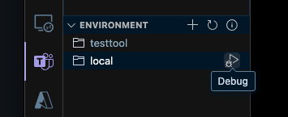
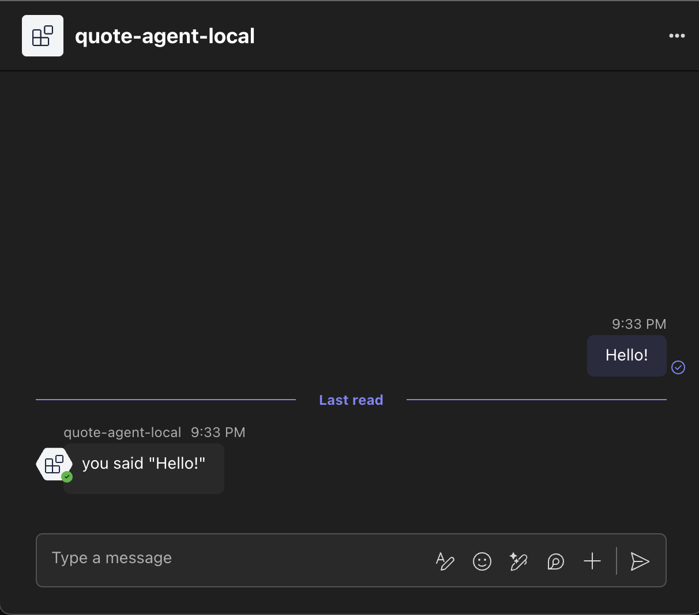

# Running in Teams

Now that you have your agent running locally, let's deploy it to Microsoft Teams for testing. This guide will walk you through the process of running your agent directly in Teams.

## Installing Teams Toolkit

First, you'll need to install the Teams Toolkit extension:

1. Visit the [Teams Toolkit installation guide](https://learn.microsoft.com/en-us/microsoftteams/platform/toolkit/install-teams-toolkit?tabs=vscode)
2. Follow the instructions to install for your preferred IDE

> [!TIP]
> The Teams Toolkit extension makes it easy to debug and test your Teams applications directly in Microsoft Teams. If you'd like to learn the various things that it helps automate, check out [this doc](../10.teams/1.core-concepts.md)

## Adding Teams Configuration

Your agent needs some basic configuration to work with Teams. Add this by running:

```bash
npx @microsoft/teams.cli config add ttk.basic
```

This command adds the necessary configuration files that Teams Toolkit expects, including:

- Environment setup
- Teams app manifest template
- Debug configurations

## Debugging in Teams

Once you've installed Teams Toolkit and added the configuration:

1. Open your agent's project in your IDE
2. Open the Teams Toolkit panel (usually on the left sidebar)
3. Under Environment Settings, select "Local".
4. Click on Debug (Chrome) or Debug (Edge) to start debugging



The Teams Toolkit will:

- Build your application
- Start a devtunnel which will assign a public URL to your local server
- Provision the Teams app for your tenant so that it can be installed and be authenticated on Teams
- Set up all the local variables necessary for your agent to run in Teams
- Start the local server
- Open Teams in your browser
- Package your file into a Teams application zip package
- Upload the package to Teams and signal it to sideload the app (fancy word for installing this app just for you)

## Testing Your Agent

After the debugging session starts:

1. Teams will open in your browser
2. You'll be prompted to sign in (if not already)
3. Teams will ask permission to install the app
4. Once installed, you can start chatting with your agent!



Congratulations! Now you have a fully functional agent running in Microsoft Teams. You can interact with it just like any other Teams app and begin to look at the rest of the documentation to learn how to build more complex agents.
