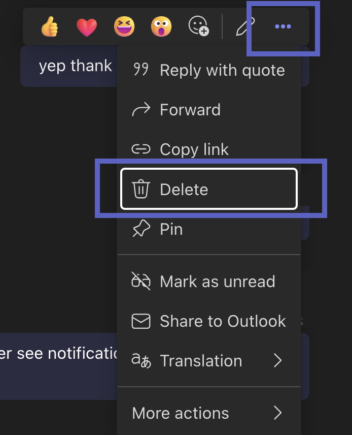

# Message Delete

Message delete activities represent a deletion of an existing message activity within a conversation. The deleted activity is referred to by the `id` and `conversation` fields within the activity.

```typescript
app.on('messageDelete', async ({ activity }) => {});
```

## Schema

Message delete activities are identified by a `type` value of `messageDelete`.

`A5800`: Channels MAY elect to send message delete activities for all deletions within a conversation, a subset of deletions within a conversation (e.g. only deletions by certain users), or no activities within the conversation.

`A5801`: Channels SHOULD NOT send message delete activities for conversations or activities that the bot did not observe.

`A5802`: If a bot triggers a delete, the channel SHOULD NOT send a message delete activity back to that bot.

`A5803`: Channels SHOULD NOT send message delete activities corresponding to activities whose type is not `message`.

## Message delete UI in Teams

To delete a message in Teams, hover over the message in the client, click on the three dots, and select "Delete" option in the dropdown menu.


