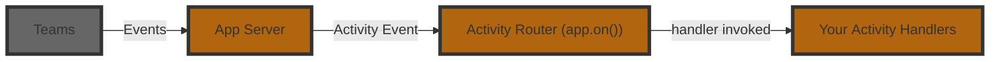

# Listening To Activities

An **Activity** is the Teams‑specific payload that flows between the user and your bot.  
Where _events_ describe high‑level happenings inside your app, _activities_ are the raw Teams messages such as chat text, card actions, installs, or invoke calls.  
The Teams AI Library v2 exposes a fluent router so you can subscribe to these activities with `app.on('<route>', …)`.



Here is an example of a basic message handler:

```ts
app.on('message', async ({ activity, send }) => {
  await send(`You said: ${activity.text}`);
});
```

In the above example, the `activity` parameter is of type `MessageActivity`, which has a `text` property. You'll notice that the handler here does not return anything, but instead handles it by `send`ing a message back. For message activities, Teams does not expect your application to return anything (though it's usually a good idea to send some sort of friendly acknowledgment!).

Other activity types have different properties and different required results. For a given handler, the library will automatically determine the type of `activity` and also enforce the correct return type.

## Middleware pattern

The `on` activity handlers follow a [middleware](https://www.patterns.dev/vanilla/mediator-pattern/) pattern similar to how `express` middlewares work. This means that for each activity handler, a `next` function is passed in which can be called to pass control to the next handler. This allows you to build a chain of handlers that can process the same activity in different ways.

```ts
app.on('message', async ({ next }) => {
  console.log('global logger');
  next(); // pass control onward
});
```

```ts
app.on('message', async ({ activity, next }) => {
  if (activity.text === '/help') {
    await send('Here are all the ways I can help you...');
    return;
  }

  // Conditionally pass control to the next handler
  next();
});
```

```ts
app.on('message', async ({ activity }) => {
  // Fallthrough to the final handler
  await send(`Hello! you said ${activity.text}`);
});
```

> [!NOTE]
> Just like other middlewares, if you stop the chain by not calling `next()`, the activity will not be passed to the next handler.

## Listening to particular messages

The above example of using a middleware pattern is so common that there is a shorthand for it in the app (using the `app.on` method).

```ts
app.
```

---

## Route Reference

| **Handler Route**                                        | **Original Route Name**               | **When It Fires**                                        |
| -------------------------------------------------------- | ------------------------------------- | -------------------------------------------------------- |
| `message`                                                | –                                     | User sends a chat message.                               |
| `message.update`                                         | –                                     | A message is edited.                                     |
| `message.delete`                                         | –                                     | A message is deleted.                                    |
| `card.action`                                            | `adaptiveCard/action`                 | An action being executed from a card action              |
| `message.submit`                                         | `message/submitAction`                | `MessageExtension submitAction` legacy invoke.           |
| `message.execute`                                        | `actionableMessage/executeAction`     | An action is executed in a particular message.           |
| `message.ext.query`                                      | `composeExtension/query`              | A query is made to add to a new message.                 |
| `message.ext.query-link`                                 | `composeExtension/queryLink`          | Query link unfurl preview.                               |
| `message.ext.anon-query-link`                            | `composeExtension/anonymousQueryLink` | Anonymous link unfurl preview.                           |
| `message.ext.select-item`                                | `composeExtension/selectItem`         | Result item selected in message‑extension.               |
| `message.ext.submit`                                     | `composeExtension/submitAction`       | Message‑extension submit after a dialog is opened.       |
| `message.ext.open`                                       | `composeExtension/fetchTask`          | Open dialog from message‑extension.                      |
| `message.ext.query-settings-url`                         | `composeExtension/querySettingUrl`    | Request the settings URL for a message‑extension.        |
| `message.ext.setting`                                    | `composeExtension/setting`            | Settings were saved from the message‑extension config.   |
| `config.open`                                            | `config/fetch`                        | Configuration dialog opening when your app is installed. |
| `config.submit`                                          | `config/submit`                       | Configuration dialog submitted.                          |
| `tab.open`                                               | `tab/fetch`                           | Static/configurable tab requested.                       |
| `tab.submit`                                             | `tab/submit`                          | Submit action from a tab submitted.                      |
| `dialog.open`                                            | `task/fetch`                          | Dialog opened.                                           |
| `dialog.submit`                                          | `task/submit`                         | Dialog submitted.                                        |
| `file.consent`                                           | `fileConsent/invoke`                  | File‑consent invoke (accept/decline).                    |
| `handoff.action`                                         | `handoff/action`                      | A hand‑off action to your agent.                         |
| `signin.token-exchange`                                  | `signin/tokenExchange`                | OAuth SSO token exchange.                                |
| `signin.verify-state`                                    | `signin/verifyState`                  | OAuth verify‑state.                                      |
| `install.initial`, `install.update`                      | –                                     | App installed / upgraded / removed.                      |
| `conversation.memberAdded`, `conversation.memberRemoved` | –                                     | Members added/removed, channel renamed, etc.             |

```

```
