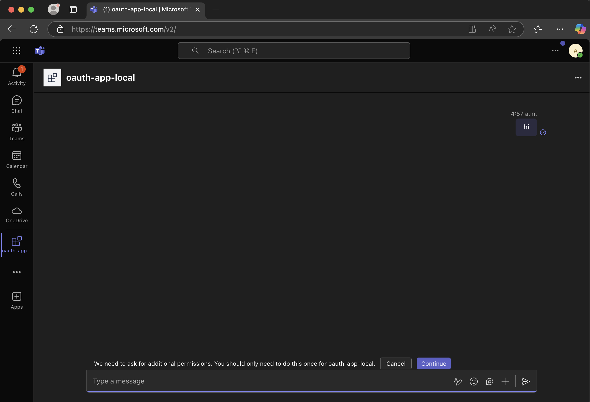
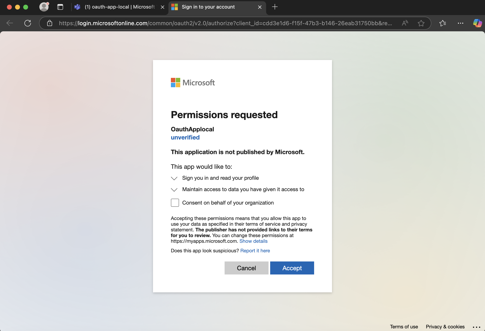
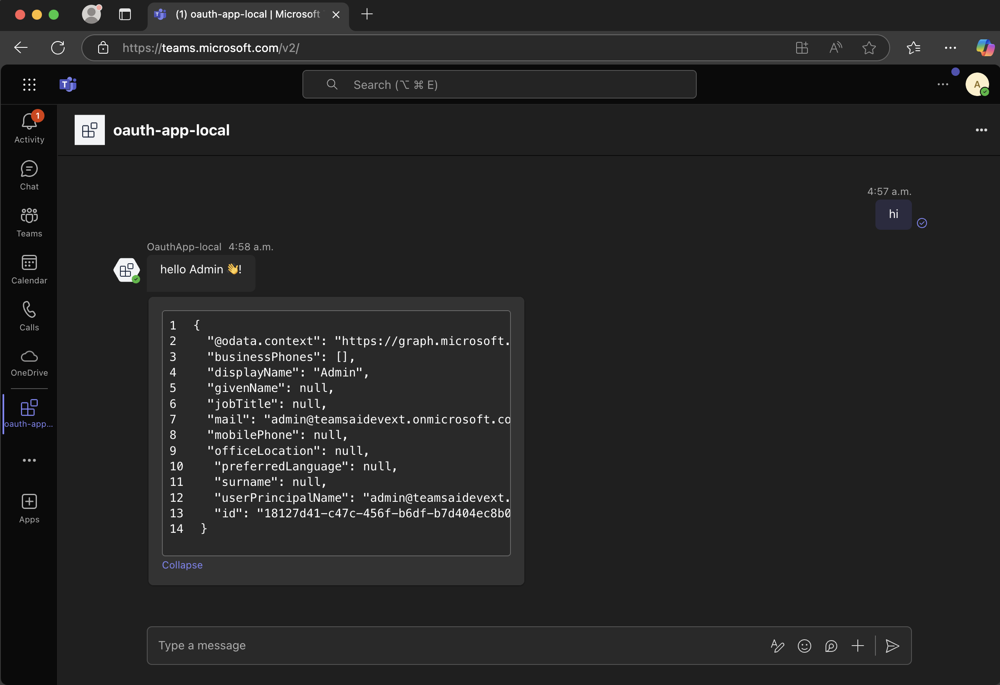
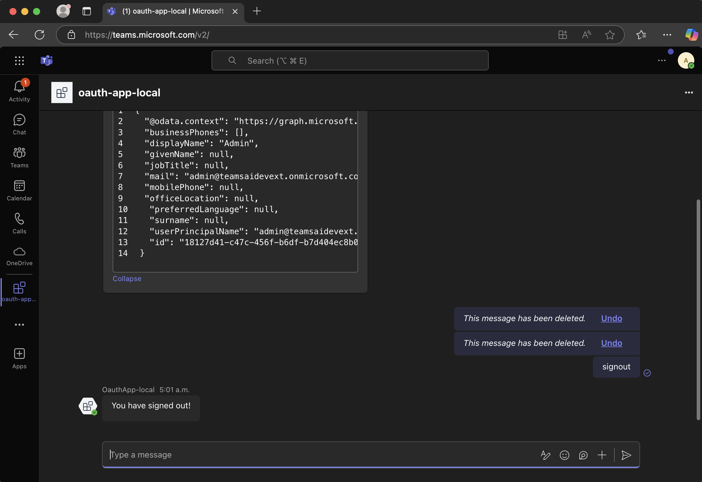

# Quickstart

In this section we will walkthrough creating an app with user authentication capabilities and authenticate into graph API

> [!Note]
>
> This is an advanced guide. It is highly recommended that you are familiar with creating an app and running it in Teams before attempting to follow this guide.

> [!Warning]
>
> User authentication does not work with the developer tools setup. You have to run the app in Teams.


## Prerequisites
- **Node.js** v.20 or higher. Install or upgrade from [nodejs.org](https://nodejs.org/).
- Teams CLI. Installation instructions [here](https://microsoft.github.io/teams-ai/2.getting-started/1.quickstart.html#install-the-teams-cli).
- Familiarilty with the [Quickstart](https://microsoft.github.io/teams-ai/2.getting-started/1.quickstart.html) Guide.
- Familiarilty with [Running in Teams](https://microsoft.github.io/teams-ai/2.getting-started/3.running-in-teams.html) Guide.

## Instructions

### Create an app with the `graph` template

> [!tip]
> Skip this step if you want to add oauth configurations to an existing app.

Use your terminal to run the following command: 

```sh
teams new oauth-app --template graph
```

This command:
1. Creates a new directory called `oauth-app`.
2. Bootstraps the graph agent template files into it under `oauth-app/src`.
3. Creates your agent's manifest files, including a `manifest.json` file and placeholder icons in the `oauth-app/appPackage` directory. The Teams [app manifest](https://learn.microsoft.com/en-us/microsoftteams/platform/resources/schema/manifest-schema) is required for [sideloading](https://learn.microsoft.com/en-us/microsoftteams/platform/concepts/deploy-and-publish/apps-upload) the app into Teams.

## Add Teams toolkit auth configuration

Open your terminal with the `oauth-app/` folder set as the curent working directory and run the following command:

```sh
teams config add ttk.oauth
```

> [!TIP]
> The `ttk.oauth` configuration is an basic setup for Teams Toolkit along with user auth capabilities. It includes the necessary files and configuration to run your app in Teams with user authentication enabled. It is essentially [`ttk.basic`](https://microsoft.github.io/teams-ai/2.getting-started/3.running-in-teams.html#adding-teams-configuration-files-via-teams-cli) configuration with a few additional files.<br/>

This [CLI](./7.developer-tools/1.cli/README.md) command adds configuration files required by Teams Toolkit, including:

- Environment setup in the `env` folder and root `.env` file
- Teams app manifest in the `appPackage` folder (if not already present)
- Debug instructions in `.vscode/launch.json` and `.vscode/tasks.json`
- TTK automation files to your project (e.g. `teamsapp.local.yml`)
- Azure Application Entra ID manifest file `aad.manifest.json`.
- Azure bicep files to provision Azure bot in `infra/` folder.

> [!Note]
>
> Teams toolkit, in the debugging flow, will deploy the `aad.manifest.json` and `infra/azure.local.bicep` file to provision the Application Entra ID and Azure bot with oauth configurations.

## Debugging in Teams

Follow these [instructions](https://microsoft.github.io/teams-ai/2.getting-started/3.running-in-teams.html#debugging-in-teams) to run your app in Teams.

## Interacting with the app in Teams

Once you have successfully sideloaded the app into Teams you can now interact with it and sign the user in. 

### Signing the user in

When the user sends a message to the user a consent form will popup:



This will ask the user to consent to the `User.ReadBasic.All` Microsoft Graph scope:



Once the user signins in and grants the app access, they will be redirected back to the Teams client and the app will send back the user's information as retrieved from the graph client:



The user can then signout by sending the `signout` command to the app:




