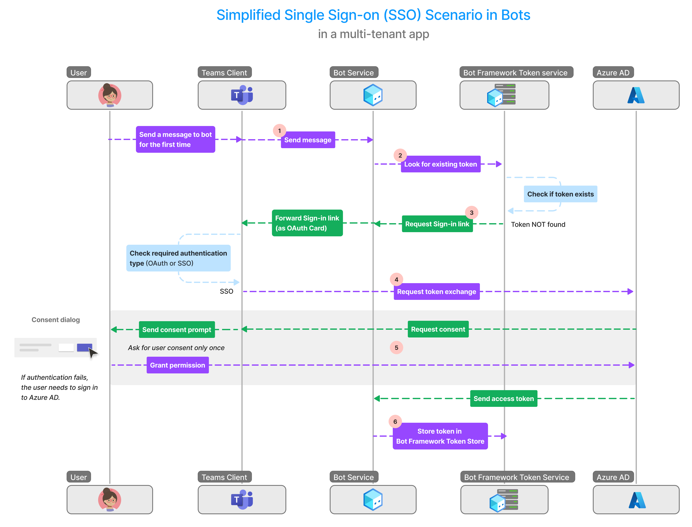
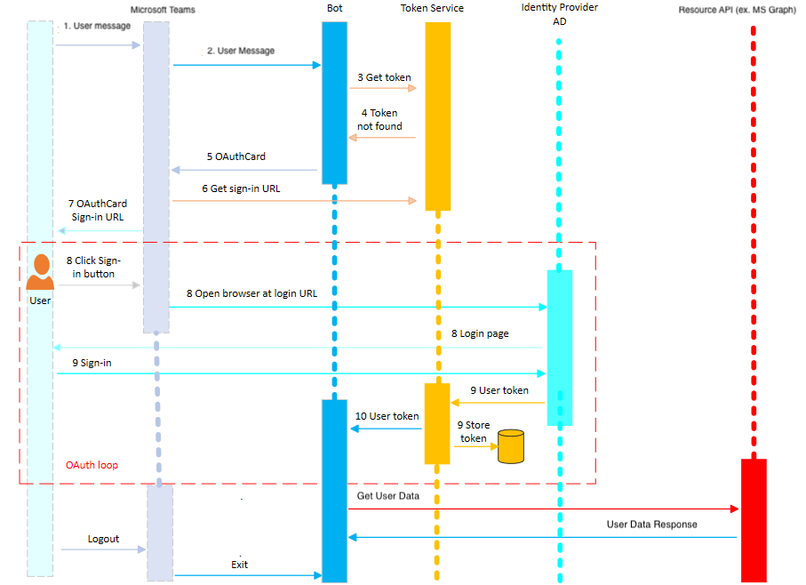

# OAuth vs SSO

When building Teams applications, choosing the right authentication method is crucial for both security and user experience. Teams supports two primary authentication approaches: OAuth and Single Sign-On (SSO). While both methods serve the same fundamental purpose of validating user identity, they differ significantly in their implementation, supported identity providers, and user experience. Understanding these differences is essential for making the right choice for your application.

The following table provides a clear comparison between OAuth and SSO authentication methods, highlighting their key differences in terms of identity providers, authentication flows, and user experience.

## Head-to-Head Comparison

| Feature | OAuth | SSO |
|---------|-------|-----|
| Identity Provider | Works with any OAuth provider (Microsoft Entra ID, Google, Facebook, GitHub, etc.) | Only works with Microsoft Entra ID |
| Authentication Flow | User is sent a card with a sign-in link | If user has already consent to the requested scopes in the past they will "silently" login through the token exchange flow. Otherwise user is shown a consent form |
| User Experience | Requires explicit sign-in | Seamless authentication using existing Teams identity |

## Single Sign-On (SSO)

Single Sign-On (SSO) in Teams provides a seamless authentication experience by leveraging a user's existing Teams identity. Once a user is logged into Teams, they can access your app without needing to sign in again. The only requirement is a one-time consent from the user, after which your app can securely retrieve their access details from Microsoft Entra ID. This consent is device-agnostic - once granted, users can access your app from any device without additional authentication steps.

> [!tip]
> Always use SSO if you authenticating the user with Microsoft Entra ID.

### The Signin Flow

Achieve SSO in a bot or message extension app by obtaining access token for the Teams app user who's signed in. This process involves the bot app client and server, Teams client, Bot Framework, and Microsoft Entra ID. During this interaction, the app user must give consent to obtain the access token in a multitenant environment.

The following image shows how SSO works when a Teams app user attempts to access the bot or message extension app:

See the [SSO in Teams at runtime](https://learn.microsoft.com/en-us/microsoftteams/platform/bots/how-to/authentication/bot-sso-overview#sso-in-teams-at-runtime) guide to learn more about the SSO signin flow

## OAuth 

You can use a third-party OAuth Identity Provider (IdP) to authenticate your app users. The app user is registered with the identity provider, which has a trust relationship with your app. When the user attempts to log in, the identity provider validates the app user and provides them with access to your app. Microsoft Entra ID is one such third party OAuth provider. You can use other providers, such as Google, Facebook, GitHub, or any other provider.

### The Signin Flow

To access external services on behalf of the user in a bot or message extension app, you'll need to obtain an access token through the OAuth signin flow. This process involves several components working together: the bot app client and server, Teams client, Bot Framework, and the OAuth provider of your choice. When a user initiates the signin process, they'll receive a card containing a signin link. Clicking this link redirects them to the external provider's authentication page where they can complete the signin process.

## Resources

- [User Authentication Basics](https://learn.microsoft.com/en-us/azure/bot-service/bot-builder-concept-authentication?view=azure-bot-service-4.0)
- [User Authentication in Teams](https://learn.microsoft.com/en-us/microsoftteams/platform/concepts/authentication/authentication)
- [Enable SSO for bot and message extension app using Entra ID](https://learn.microsoft.com/en-us/microsoftteams/platform/bots/how-to/authentication/bot-sso-overview)
- [Add authentication to your Teams bot](https://learn.microsoft.com/en-us/microsoftteams/platform/bots/how-to/authentication/add-authentication)