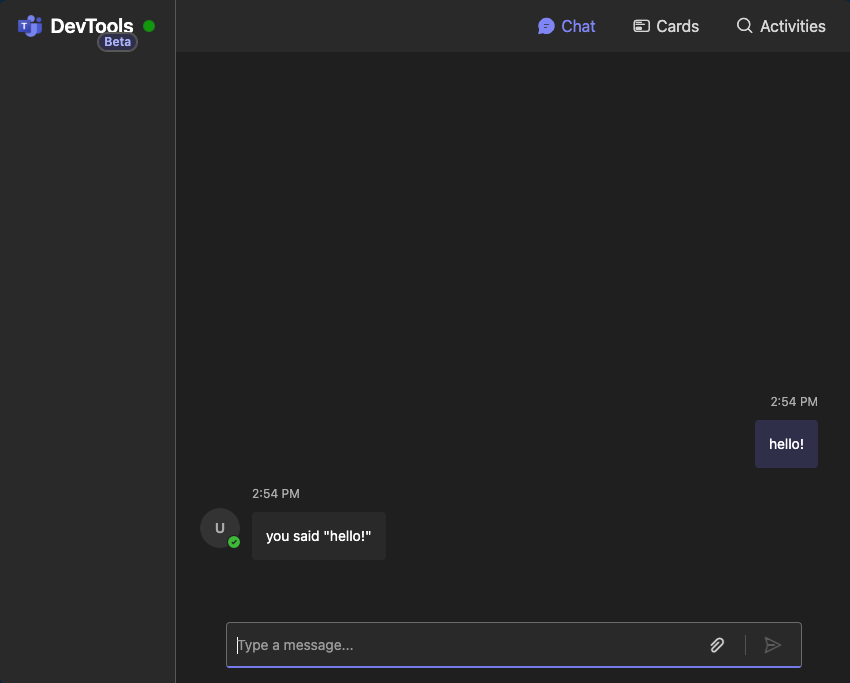

# 💬 Devtools Chat


Chat with your app just like in Teams, without needing an app ID or authentication. This is useful for testing and debugging. We plan to add more features to DevTools for a wider variety of testing. Stay tuned!

## Using DevTools

You can use the Teams AI v2 dev package as a plugin for your app.

### Installation

Add the package to your Teams app.

```bash
$: npm install @microsoft/teams.dev
```

### Usage

In your app's main file, ensure DevTools plugin is added to the app.

> [!CAUTION]<br/>
> DevTools is not secure and should not be used in production environments. Remove the plugin before deploying your app to production.

```typescript
import { App } from "@microsoft/teams.apps";
import { ConsoleLogger } from "@microsoft/teams.common/logging";
import { DevtoolsPlugin } from "@microsoft/teams.dev";
//... Other imports here
const app = new App({
  logger: new ConsoleLogger("@samples/echo", { level: "debug" }),
  plugins: [new DevtoolsPlugin()]
});
```

When you run your app, for example `npm run dev`, devtools will be running on port 3001

```bash
[nodemon] watching extensions: ts
[nodemon] starting `node -r ts-node/register -r dotenv/config ./src/index.ts`
[INFO] @samples/echo/http listening on port 3000 🚀
[INFO] @samples/echo/devtools available at http://localhost:3001/devtools
```

> [!NOTE]<br/>
> If you used the [CLI](../1.cli/) to create a TTK configuration for your app, DevTools will run on port 3979 when you launch the debugger.

When you open the page, you will see a Teams-like chat window and you can immediately interact with your agent.



## Teams chat terminology

Below is a brief list of the terminology used in the chat window and in Teams:

1. **Compose box**: The area where you type your message and attach files. A newly rendered Chat page will automatically focus on the compose box.
2. **Message actions menu**: The menu that appears when you hover over or focus on a message, offering different actions depending on whether you sent or received the message.

## Chat capabilities

The chat window emulates Teams features as closely as possible. Not all Teams features are available in DevTools, but we are working to add more features over time. The following capabilities are available:

> [!CAUTION]<br/>
> Accessibility and keyboard navigation are not fully supported in DevTools. We are working to improve this experience over time. Please know that we take accessibility seriously and are working to improve the experience for all users.

### Send messages
You can [send messages](../../3.essentials/3.sending-activities.md) to your agent just like in Teams. Use the compose box to type a message and Use <kbd>Tab</kbd> to navigate to the compose box and type your message. Press <kbd>Enter</kbd> to send the message.

### Attachments

 Attach up to 10 files to your message using the Attach (paperclip) button. DevTools supports pasting an Adaptive Card JSON or attaching a card from the card designer. See the [Cards page](./3.cards.md) for more.

 > [!NOTE]<br/>
 > More attachments support is coming soon!

 To remove an attachment, use the Dismiss (X) button and the attachment will be removed.

 ### Connectivity

Check your app's connectivity in three ways:

1. The DevTools banner shows a green badge or 'Connected' text when connected, and red or 'Disconnected' when not.
2. Similarly, the agent's avatar shows a 'Connected' or 'Disconnected' badge.
3. DevTools has a [Logger](../../5.in-depth-guides/6.observability/) that logs connectivity events to the console. Use the browser's console tool to see the logs.

### Message reactions

 You can [react to messages](../../9.activity/1.message/2.message-reaction.md) selecting an emoji in the message actions menu.


### Edit your message
[Edit messages](../../9.activity/1.message/1.message-update.md) by selecting the Edit (pencil) icon from the message actions menu. Press Enter or the checkmark button to send the edited message, or the Dismiss (X) button to cancel.

### Delete your message

Soft [delete messages](../../9.activity/1.message/3.message-delete.md) by hovering over your message, pressing the More (ellipsis) button, then the Delete (trash) button. Click "Undo" to restore the message.

### Streaming

If your agent is using [streaming](../../5.in-depth-guides/5.ai/1.chat/2.streaming.md),DevTools will render messages as a stream with a rainbow border until the stream ends. See the full stream on the [Activities](2.inspect.md) page by clicking the Inspect (magnifying glass) button in the message actions menu of the message.

### Feedback

Send [feedback](../../5.in-depth-guides/5.ai/7.feedback.md) to your app by clicking the Feedback (thumbs up/down) buttons in the message actions menu and completing the dialog form.


> [!NOTE]<br/>
> The capabilities above will also populate activities to the Activities page, where you can inspect activity payloads and see the full activity history.

### Developer message shortcut

For easier debugging, the compose box stores the last five messages sent to the app. Press the Up <kbd>↑</kbd> arrow key to cycle through your message history and resend messages.


