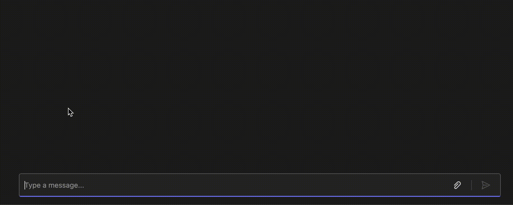

# Sending Messages

Sending messages is a core part of an agent's functionality. With all activity handlers, a `send` method is provided which allows your handlers to send a message back to the user to the relevant conversation. 

<!-- langtabs-start -->
```typescript
app.on('message', async ({ activity, send }) => {
  await send(`You said: ${activity.text}`);
});
```
<!-- langtabs-end -->

In the above example, the handler gets a `message` activity, and uses the `send` method to send a reply to the user.

<!-- langtabs-start -->
```typescript
app.on('signin.verify-state', async ({ send }) => {
  await send('You have successfully signed in!');
});
```
<!-- langtabs-end -->

You are not restricted to only replying to `message` activities. In the above example, the handler is listening to `signin.verify-state` events, which are sent when a user successfully signs in. 

> [!TIP]
> This shows an example of sending a text message. Additionally, you are able to send back things like [adaptive cards](../in-depth-guides/cards/README.md) by using the same `send` method. Look at the [adaptive card](../in-depth-guides/README.md) section for more details.

## Streaming

You may also stream messages to the user which can be useful for long messages, or AI generated messages. The library makes this simple for you by providing a `stream` function which you can use to send messages in chunks. 

<!-- langtabs-start -->
```typescript
app.on('message', async ({ activity, stream }) => {
  stream.emit('hello');
  stream.emit(', ');
  stream.emit('world!');

  // result message: "hello, world!"
});
```
<!-- langtabs-end -->

> [!NOTE]
> Streaming is currently only supported in 1:1 conversations, not group chats or channels



## @Mention

Sending a message at `@mentions` a user is as simple including the details of the user using the `addMention` method

<!-- langtabs-start -->
```typescript
app.on('message', async ({ send, activity }) => {
  await send(new MessageActivity('hi!').addMention(activity.from));
});
```
<!-- langtabs-end -->
