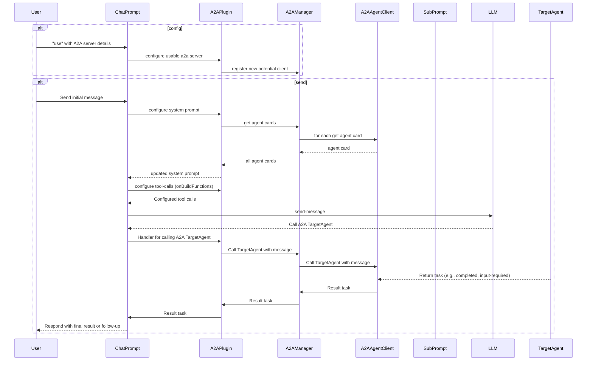

# A2A Client

## What is an A2A Client?

An A2A client is an agent or application that can proactively send tasks to A2A servers and interact with them using the A2A protocol.

## Using AgentManager to Call A2A Servers

You can use the `AgentManager` to register and send tasks to different A2A servers:

```ts
{{ #include ../../../../generated-snippets/ts/client-example.snippet.a2a-client-directly-use-agent-manager-example.ts }}
```

## Using A2AClientPlugin with ChatPrompt

A2A is most effective when used with an LLM. The `A2AClientPlugin` can be added to your chat prompt to allow interaction with A2A agents. Once added, the plugin will automatically configure the system prompt and tool calls to determine if the a2a server is needed for a particular task, and if so, it will do the work of orchestrating the call to the A2A server.

```ts
{{ #include ../../../../generated-snippets/ts/client-example.snippet.a2a-client-use-with-chat-prompt-example.ts }}
```
```ts
{{ #include ../../../../generated-snippets/ts/client-example.snippet.a2a-client-use-with-chat-prompt-example-send.ts }}
```


## Sequence Diagram



## Notes

-   This package and the A2A protocol are experimental.
-   Ensure you handle errors and edge cases when interacting with remote agents.

## Further Reading

-   [A2A Protocol](https://google.github.io/A2A)
