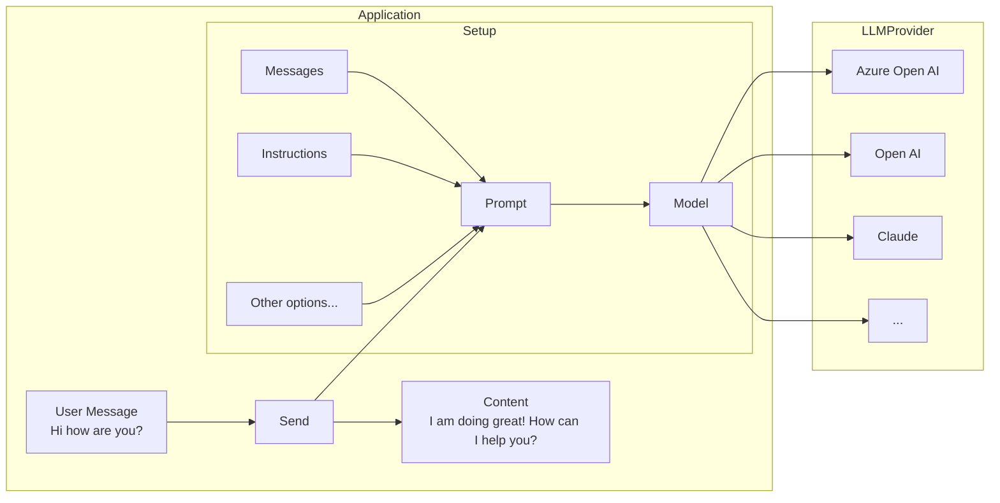

# Chat Generation

Before going through this guide, please make sure you have completed the [setup and prerequisites](./setup-and-prereqs.md) guide.

# Setup

The basic setup involves creating a `ChatPrompt` and giving it the `Model` you want to use.



## Simple chat generation

Chat generation is the the most basic way of interacting with an LLM model. It involves setting up your ChatPrompt, the Model, and sending it the message.

Import the relevant objects:

<!-- langtabs-start -->
```typescript
{{#include ../../../generated-snippets/ts/index.snippet.ai-imports.ts }}
```
<!-- langtabs-end -->

<!-- langtabs-start -->
```typescript
{{#include ../../../generated-snippets/ts/index.snippet.simple-chat.ts }}
```
<!-- langtabs-end -->

> [!NOTE]
> The current `OpenAIChatModel` implementation uses chat-completions API. The responses API is coming soon.

## Streaming chat responses

LLMs can take a while to generate a response, so often streaming the response leads to a better, more responsive user experience.

> [!IMPORTANT]
> Streaming is only currently supported for single 1:1 chats, and not for groups or channels.

<!-- langtabs-start -->
```typescript
{{#include ../../../generated-snippets/ts/index.snippet.streaming-chat.ts }}
```
<!-- langtabs-end -->


