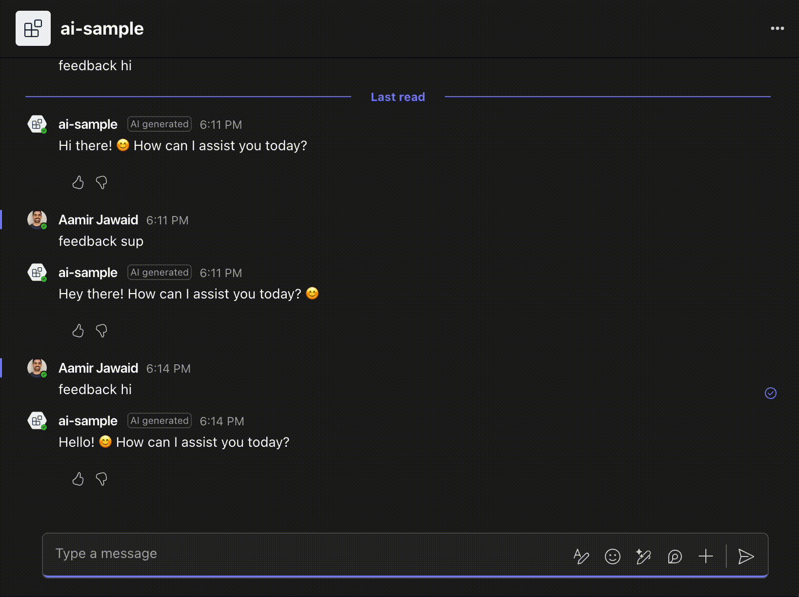

# Feedback

User feedback is essential for the improvement of any application. Teams provides specialized UI components to help facilitate the gathering of feedback from users.



## Storage

Once you receive a feedback event, you can choose to store it in some persistent storage. In the example below, we are storing it in an in-memory store.

<!-- langtabs-start -->
```typescript
{{#include ../../generated-snippets/ts/feedback.snippet.feedback-loop-store.ts }}
```
<!-- langtabs-end -->

## Including Feedback Buttons

When sending a message that you want feedback in, simply `addFeedback()` to the message you are sending.

<!-- langtabs-start -->
```typescript
{{#include ../../generated-snippets/ts/feedback.snippet.feedback-loop.ts }}
```
<!-- langtabs-end -->

## Handling the feedback

Once the user decides to like/dislike the message, you can handle the feedback in a received event. Once received, you can choose to include it in your persistent store.

<!-- langtabs-start -->
```typescript
{{#include ../../generated-snippets/ts/index.snippet.feedback-loop-handler.ts }}
```
<!-- langtabs-end -->
