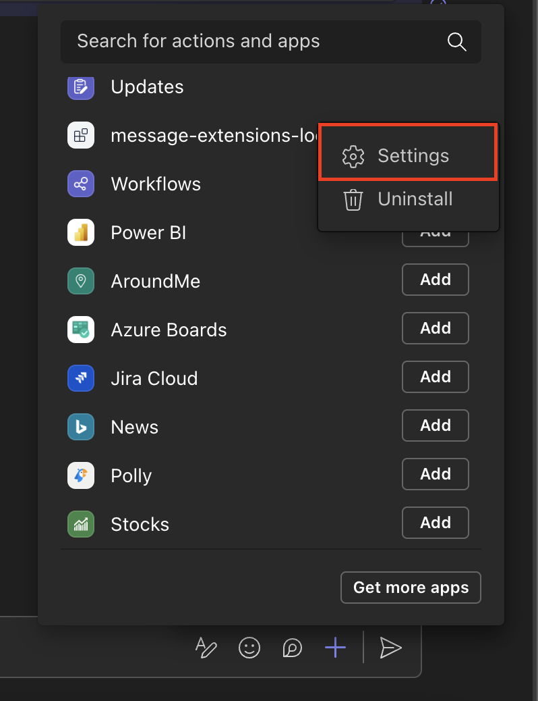
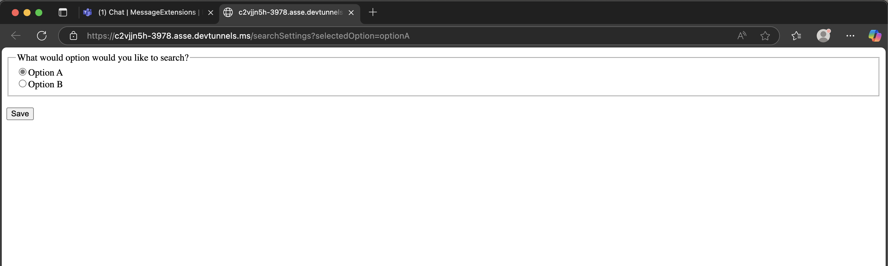

# Search Settings

You can add a settings page that allows users to configure settings for your app.

The user can access the settings by right-clicking the app item in the compose box

<br/>


This guide will show how to enable user access to settings, as well as setting up a page that looks like this:



## 1. Update the Teams Manifiest

Set the `canUpdateConfiguration` field to `true` in the desired message extension under `composeExtensions`.

<!-- langtabs-start -->
```json
    "composeExtensions": [
        {
            "botId": "${{BOT_ID}}",
            "canUpdateConfiguration": true,
            ...
        }
    ]
```
<!-- langtabs-end -->

## 2. Serve the settings `html` page

This is the code snippet for the settings `html` page:

<!-- langtabs-start -->
```html
{{#include ../../../generated-snippets/ts/searchSettings.snippet.message-ext-settings-page.html }}
```
<!-- langtabs-end -->

Save it in the `searchSettings.html` file in the same folder as where you app is initialized.

You can serve it by adding the following code to your app:

<!-- langtabs-start -->
```ts
{{#include ../../../generated-snippets/ts/index.snippet.message-ext-serve-html.ts }}
```
<!-- langtabs-end -->

> [!note]
> You can import `npath` from `path` or resolve the path using a separate method.

## 3. Specify the URL to the settings page

To enable the settings page, your app needs to handle the `message.ext.query-settings-url` activity that Teams sends when a user right-clicks the app in the compose box. Your app must respond with the URL to your settings page. Here's how to implement this:

<!-- langtabs-start -->
```ts
{{#include ../../../generated-snippets/ts/index.snippet.message-ext-query-settings-url.ts }}
```
<!-- langtabs-end -->

## 4. Handle Form Submission

When a user submits the settings form, Teams sends a `message.ext.setting` activity with the selected option in the `activity.value.state` property. Handle it to save the user's selection:

<!-- langtabs-start -->
```ts
{{#include ../../../generated-snippets/ts/index.snippet.message-ext-setting.ts }}
```
<!-- langtabs-end -->