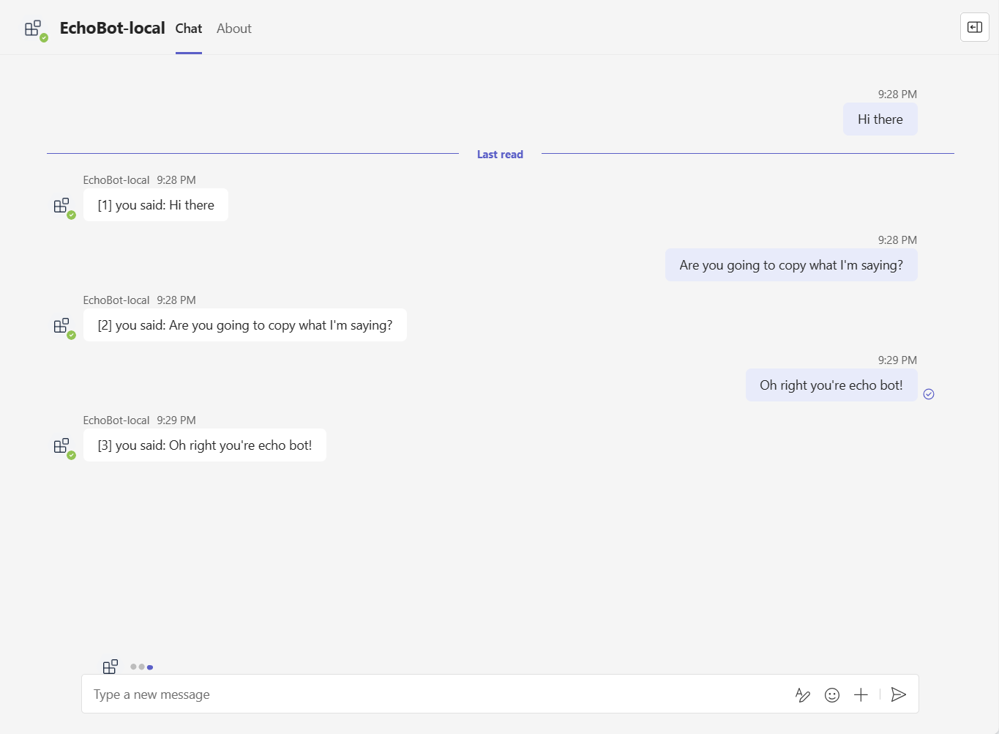
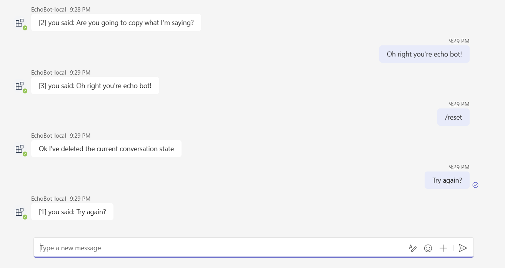

# Teams Conversation Bot

Teams AI  Conversation Bot sample for Teams.

This sample shows how to incorporate basic conversational flow into a Teams application. 
It also illustrates a few of the Teams specific calls you can make from your bot.

## Set up instructions

All the samples in the C# .NET SDK can be set up in the same way: You can find the step by step instructions here:
 [Setup Instructions](../README.md).

## Interacting with the Bot

At this point you should have set up the bot and installed it in Teams. You can interact with the bot by sending it a message.

Here's a sample interaction with the bot:

You can reset the message count by sending the bot the message `/reset`.

## Deploy to Azure

You can use Teams Toolkit for Visual Studio or CLI to host the bot in Azure. The sample includes Bicep templates in the `/infra` directory which are used by the tools to create resources in Azure.

You can find deployment instructions [here](../README.md#deploy-to-azure).