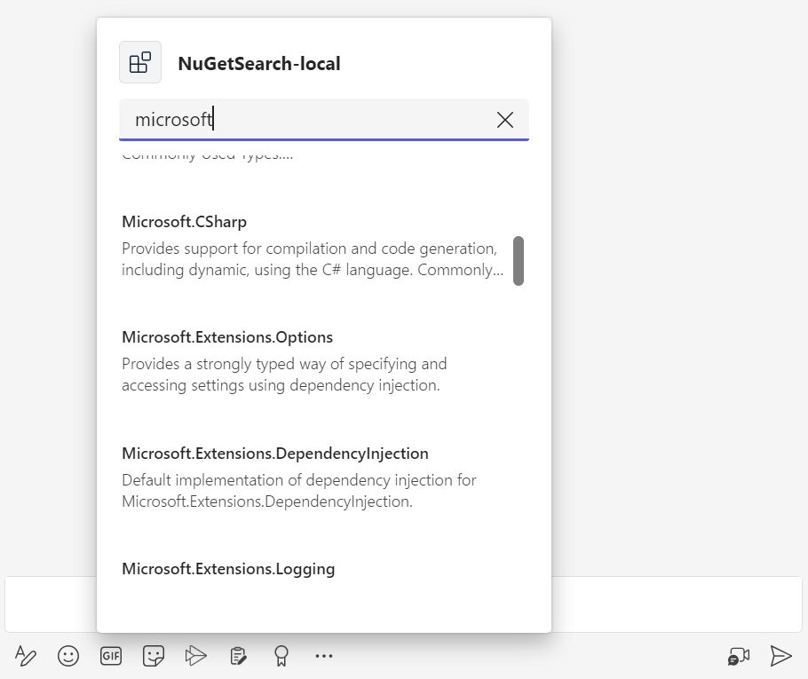

## Summary

This sample shows how to incorporate a basic Message Extension app into a Microsoft Teams application using [Bot Framework](https://dev.botframework.com) and the Teams AI SDK. Users can search npmjs for packages.

## Set up instructions

All the samples in for the C# .NET SDK can be set up in the same way. You can find the step by step instructions here:
 [Setup Instructions](../README.md).

## Interacting with the Message Extension

You can interact with this app by selecting it's app icon in the chat compose area. This opens a dialog that allows you to search NPM for a package. Selecting a package will output an Adaptive Card with it's description to the chat.

Here's a sample search result:

And after selecting it outputs an Adaptive Card.

## Deploy to Azure with Teams Toolkit

You can use Teams Toolkit for Visual Studio or CLI to host the bot in Azure. The sample includes Bicep templates in the `/infra` directory which are used by the tools to create resources in Azure.

Use the "Teams Toolkit" > "Provision in the Cloud...", "Teams Toolkit" > "Deploy to the Cloud" from project right-click menu, or from the CLI with `teamsfx provision` and `teamsfx deploy`. [Visit the documentation](https://learn.microsoft.com/microsoftteams/platform/toolkit/provision) for more info on hosting your app in Azure with Teams Toolkit.

Alternatively, you can learn more about deploying a bot to Azure manually in the [Deploy your bot to Azure](https://aka.ms/azuredeployment) documentation.

## Further reading

- [Teams Toolkit overview](https://aka.ms/vs-teams-toolkit-getting-started)
- [How Microsoft Teams bots work](https://learn.microsoft.com/azure/bot-service/bot-builder-basics-teams?view=azure-bot-service-4.0&tabs=csharp)