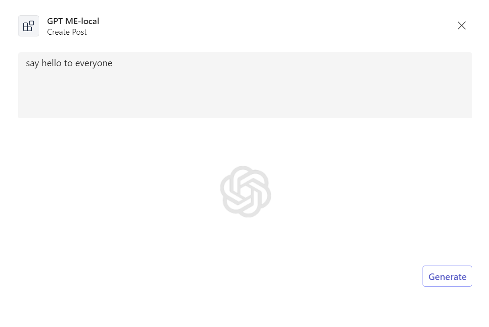
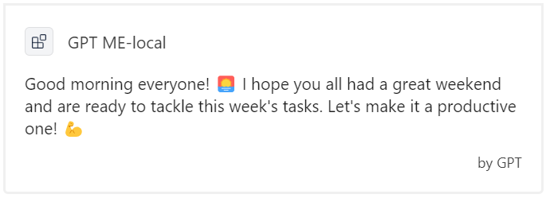

# AI in Microsoft Teams: Twenty Qestions

This sample is a message extension (ME) for Microsoft Teams that leverages the text-davinci-003 model to help users generate and update posts. The extension is designed to assist users in creating posts that are appropriate for a business environment.

This sample illustrates basic ME behavior in Microsoft Teams. The ME is built to allow GPT to facilitate the conversation by generating posts based on what the user requires. e.g., "Make my post sound more professional."

It shows Teams AI SDK capabilities like:

<details open>
    <summary><h3>Message extension scaffolding</h3></summary>
    Throughout the 'Program.cs' and 'GPtMessageExtension.cs' files you'll see the scaffolding created to run a simple message extension, like storage, authentication, task modules, and action submits.
</details>
<details open>
    <summary><h3>Prompt engineering</h3></summary>
The `Prompts/Generate/` and `Prompts/Update/` directories have descriptive prompt engineering that, in plain language, instructs GPT how the message extension should conduct itself at submit time. For example, in `Prompts/Generate/skprompt.txt`:

#### skprompt.txt

```text
This is a Microsoft Teams extension that assists the user with creating posts.
Using the prompt below, create a post that appropriate for a business environment.

Prompt: {{$prompt}}
Post:
```

- The major section ("*This is a ... business environment.*") defines the basic direction, to tell how AI should behave on human's input.
- The final section ("*Prompt: ... Post: ...*") defines the human's input and let AI to generate the post response.
- Variable "*{{$prompt}}*" is set via `AI.Prompt.Variables` in `GPtMessageExtension.cs`.
- You can also add function call via `AI.Prompt.AddFunction`, then reference it as "*{{function}}*" in prompt.

</details>

## Set up instructions

All the samples in for the C# .NET SDK can be set up in the same way. You can find the step by step instructions here:
 [Setup Instructions](../README.md).

Note that, this sample requires AI service so you need one more pre-step before Local Debug (F5).

1. Set your [OpenAI API Key](https://openai.com/api/) to *appsettings.Development.json*.

    ```json
      "OpenAI": {
        "ApiKey": "<your-openai-api-key>"
      },
    ```

## Interacting with the Message Extension

You can interact with this app by selecting its app icon in the chat compose area. This opens a dialog that allows you to create a post with GPT.

Here's a sample interaction with the app:



And after clicking "Post" it outputs an Adaptive Card.



## Deploy to Azure

You can use Teams Toolkit for Visual Studio or CLI to host the bot in Azure. The sample includes Bicep templates in the `/infra` directory which are used by the tools to create resources in Azure.

You can find deployment instructions [here](../README.md#deploy-to-azure).

Note that, this sample requires AI service so you need one more pre-step before deploy to Azure. To configure the Azure resources to have an environment variable for the OpenAI Key:

1. In `./env/.env.dev.user` file, paste your [OpenAI API Key](https://openai.com/api/) to the environment variable `SECRET_OPENAI_KEY=`.

The `SECRET_` prefix is a convention used by Teams Toolkit to mask the value in any logging output and is optional.

## Use Azure OpenAI

Above steps use OpenAI as AI service, optionally, you can also use Azure OpenAI as AI service.

**As prerequisites**

1. Prepare your own Azure OpenAI service and Azure AI Content Safety service.
1. Modify source code `Program.cs`, comment out the "*#Use OpenAI*" part, and uncomment the "*#Use Azure OpenAI and Azure Content Safety*" part.

**For Local Debug (F5) with Teams Toolkit for Visual Studio**

1. Set your Azure OpenAI related settings to *appsettings.Development.json*.

    ```json
      "Azure": {
        "OpenAIApiKey": "<your-azure-openai-api-key>",
        "OpenAIEndpoint": "<your-azure-openai-endpoint>",
        "ContentSafetyApiKey": "<your-azure-content-safety-api-key>",
        "ContentSafetyEndpoint": "<your-azure-content-safety-endpoint>"
      }
    ```

**For Deploy to Azure with Teams Toolkit for Visual Studio**

To configure the Azure resources to have Azure OpenAI environment variables:

1. In `./env/.env.dev.user` file, paste your Azure OpenAI related variables.

    ```bash
    SECRET_AZURE_OPENAI_API_KEY=
    SECRET_AZURE_OPENAI_ENDPOINT=
    SECRET_AZURE_CONTENT_SAFETY_API_KEY=
    SECRET_AZURE_CONTENT_SAFETY_ENDPOINT=
    ```

## Further reading

- [Teams Toolkit overview](https://aka.ms/vs-teams-toolkit-getting-started)
- [How Microsoft Teams bots work](https://learn.microsoft.com/azure/bot-service/bot-builder-basics-teams?view=azure-bot-service-4.0&tabs=csharp)