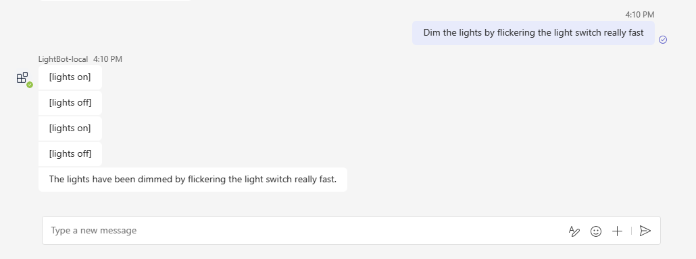

# Teams Light Bot

A conversational bot for Microsoft Teams, designed as an AI assistant. The bot connects to a third-party service to turn a light on or off.

This sample illustrates more complex conversational bot behavior in Microsoft Teams. The bot is built to allow GPT to facilitate the conversation on its behalf as well as manually defined responses, and maps user intents to user defined actions.

It shows following SDK capabilities:

<details open>
    <summary><h3>Bot scaffolding</h3></summary>
    Throughout the 'Program.cs' and 'TeamsLightBot.cs' files you'll see the scaffolding created to run a bot with AI features.
</details>
<details open>
    <summary><h3>Prompt engineering</h3></summary>
The 'Prompts/chatGPT/skprompt.txt' file has descriptive prompt engineering that, in plain language, instructs GPT how the bot should conduct itself at submit time. For example, in 'skprompt.txt':

#### skprompt.txt

```text
The following is a conversation with an AI assistant. 
The assistant can turn a light on or off.
The assistant must return the following JSON structure:

{"type":"plan","commands":[{"type":"DO","action":"<name>","entities":{"<name>":<value>}},{"type":"SAY","response":"<response>"}]}

The following actions are supported:

- LightsOn
- LightsOff
- Pause time=<duration in ms>
- LightStatus

The lights are currently {{getLightStatus}}.

Always respond in the form of a JSON based plan. Stick with DO/SAY.
```

## Set up instructions

All the samples for the C# .NET SDK can be set up in the same way: You can find step by step instructions here:
 [Setup Instructions](../README.md).

Note that, this sample requires AI service so you need one more pre-step before Local Debug (F5).

1. Set your [OpenAI API Key](https://openai.com/api/) to *appsettings.Development.json*.

    ```json
      "OpenAI": {
        "ApiKey": "<your-openai-api-key>"
      },
    ```

## Interacting with the Bot

At this point you should have set up the bot and installed it in Teams. You can interact with the bot by sending it a message.

Here's a sample interaction with the bot:


You can also ask it to dim the lights by flickering the switch really fast.



## Deploy to Azure

You can use Teams Toolkit for Visual Studio or CLI to host the bot in Azure. The sample includes Bicep templates in the `/infra` directory which are used by the tools to create resources in Azure.

To configure the Azure resources to have an environment variable for the OpenAI Key:

Use the "Teams Toolkit" > "Provision in the Cloud...", "Teams Toolkit" > "Deploy to the Cloud" from project right-click menu, or from the CLI with `teamsfx provision` and `teamsfx deploy`. [Visit the documentation](https://learn.microsoft.com/microsoftteams/platform/toolkit/provision) for more info on hosting your app in Azure with Teams Toolkit.

Alternatively, you can learn more about deploying a bot to Azure manually in the [Deploy your bot to Azure](https://aka.ms/azuredeployment) documentation.

## Further reading

- [Teams Toolkit overview](https://aka.ms/vs-teams-toolkit-getting-started)
- [How Microsoft Teams bots work](https://learn.microsoft.com/azure/bot-service/bot-builder-basics-teams?view=azure-bot-service-4.0&tabs=csharp)