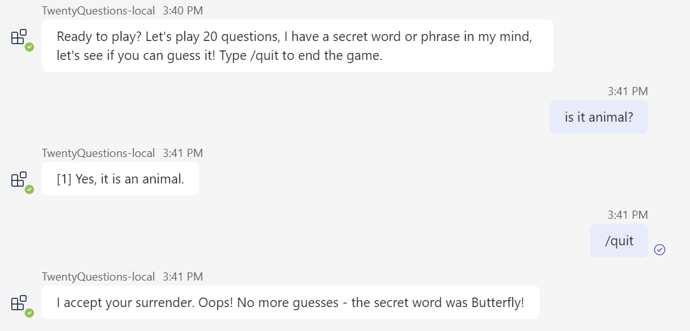

# AI in Microsoft Teams: Twenty Qestions

Welcome to the 20 Questions Bot: The Ultimate Guessing Game! This developer sample application showcases the incredible capabilities of language models and the concept of user intent. Challenge your skills as the human player and try to guess a secret within 20 questions, while the AI-powered bot answers your queries about the secret. Experience firsthand how language models interpret user input and provide informative responses, creating an engaging and interactive gaming experience. Get ready to dive into the world of language models and explore the fascinating realm of user interaction and intent.
It shows following SDK capabilities:

<details open>
    <summary><h3>Bot scaffolding</h3></summary>
    Throughout the 'Program.cs' and 'GameBot.cs' files you'll see the scaffolding created to run a bot with AI features.
</details>
<details open>
    <summary><h3>Prompt engineering</h3></summary>
The 'Prompts/Hint/skprompt.txt' file has descriptive prompt engineering that, in plain language, instructs GPT how the bot should conduct itself at submit time. For example, in 'skprompt.txt':

#### skprompt.txt

```text
You are the AI in a game of 20 questions. 
The goal of the game is for the Human to guess a secret within 20 questions. 
The AI should answer questions about the secret.
The AI should assume that every message from the Human is a question about the secret.

GuessCount: {{$guessCount}}
RemainingGuesses: {{$remainingGuesses}}
Secret: {{$secretWord}}

Answer the humans question but do not mention the secret word.

Human: {{$input}}
AI: 
```

- The major section ("*You are the AI ... the secret word.*") defines the basic direction, to tell how AI should behave on human's input.
- Variables "*{{$guessCount}}*", "*{{$remainingGuesses}}*" and "*{{$secretWord}}*" are set via `AI.Prompt.Variables` in `GameBot.cs`.
- You can also add function call via `AI.Prompt.AddFunction`, then reference it as "*{{function}}*" in prompt.
- The final section ("*Human: ... AI: ...*") defines the input of current turn. In addition, you can also add "*{{$history}}*" here to let AI to know the context about previous turns.
- "*{{input}}*", "*{{output}}*" and "*{{history}}*" are automatically resolved from `TurnState.Temp`.

</details>

## Set up instructions

All the samples in for the C# .NET SDK can be set up in the same way. You can find the step by step instructions here:
 [Setup Instructions](../README.md).

Note that, this sample requires AI service so you need one more pre-step before Local Debug (F5).

1. Set your [OpenAI API Key](https://openai.com/api/) to *appsettings.Development.json*.

    ```json
      "OpenAI": {
        "ApiKey": "<your-openai-api-key>"
      },
    ```

## Interacting with the Bot

At this point you should have set up the bot and installed it in Teams. You can interact with the bot by sending it a message.

Here's a sample interaction with the bot:


You can quit the game by sending the message `/quit`.



## Deploy to Azure

You can use Teams Toolkit for Visual Studio or CLI to host the bot in Azure. The sample includes Bicep templates in the `/infra` directory which are used by the tools to create resources in Azure.

You can find deployment instructions [here](../README.md#deploy-to-azure).

Note that, this sample requires AI service so you need one more pre-step before deploy to Azure. To configure the Azure resources to have an environment variable for the OpenAI Key:

1. In `./env/.env.dev.user` file, paste your [OpenAI API Key](https://openai.com/api/) to the environment variable `SECRET_OPENAI_KEY=`.

The `SECRET_` prefix is a convention used by Teams Toolkit to mask the value in any logging output and is optional.

## Use Azure OpenAI

Above steps use OpenAI as AI service, optionally, you can also use Azure OpenAI as AI service.

**As prerequisites**

1. Prepare your own Azure OpenAI service and Azure AI Content Safety service.
1. Modify source code `Program.cs`, comment out the "*#Use OpenAI*" part, and uncomment the "*#Use Azure OpenAI and Azure Content Safety*" part.

**For Local Debug (F5) with Teams Toolkit for Visual Studio**

1. Set your Azure OpenAI related settings to *appsettings.Development.json*.

    ```json
      "Azure": {
        "OpenAIApiKey": "<your-azure-openai-api-key>",
        "OpenAIEndpoint": "<your-azure-openai-endpoint>",
        "ContentSafetyApiKey": "<your-azure-content-safety-api-key>",
        "ContentSafetyEndpoint": "<your-azure-content-safety-endpoint>"
      }
    ```

**For Deploy to Azure with Teams Toolkit for Visual Studio**

To configure the Azure resources to have Azure OpenAI environment variables:

1. In `./env/.env.dev.user` file, paste your Azure OpenAI related variables.

    ```bash
    SECRET_AZURE_OPENAI_API_KEY=
    SECRET_AZURE_OPENAI_ENDPOINT=
    SECRET_AZURE_CONTENT_SAFETY_API_KEY=
    SECRET_AZURE_CONTENT_SAFETY_ENDPOINT=
    ```

## Further reading

- [Teams Toolkit overview](https://aka.ms/vs-teams-toolkit-getting-started)
- [How Microsoft Teams bots work](https://learn.microsoft.com/azure/bot-service/bot-builder-basics-teams?view=azure-bot-service-4.0&tabs=csharp)