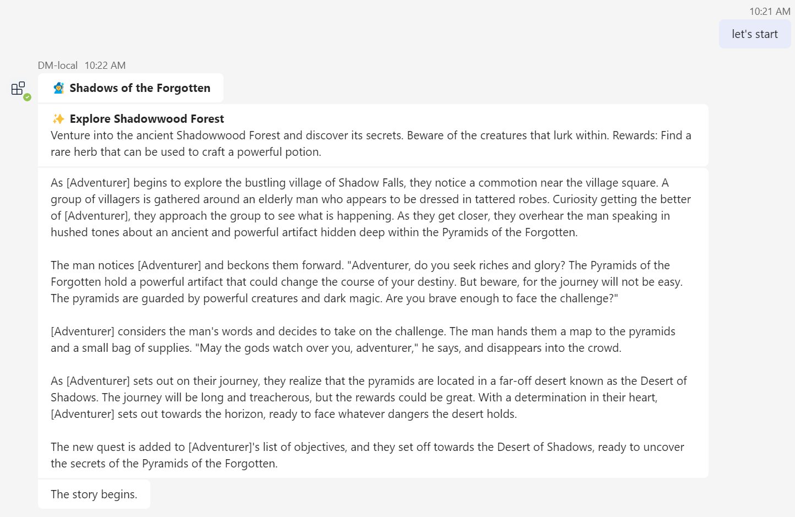
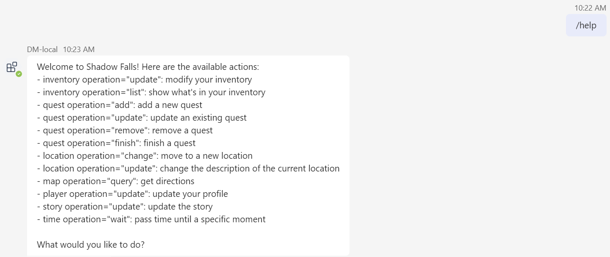

# AI in Microsoft Teams: Quest Bot

Welcome to the Quest Bot: An epic text adventure powered by AI. The bot plays a role of the dungeon master (DM) for a classic text adventure game. Users are adventurers to explorer the campaign and achieve objectives designed by the bot.
It shows following SDK capabilities:

<details open>
    <summary><h3>Bot scaffolding</h3></summary>
    Throughout the 'Program.cs' and 'TeamsQuestBot.cs' files you'll see the scaffolding created to run a bot with AI features.
</details>
<details open>
    <summary><h3>Prompt engineering</h3></summary>
The 'Prompts/**/skprompt.txt' file has descriptive prompt engineering that, in plain language, instructs GPT how the bot should conduct itself at submit time. For example, in 'Help/skprompt.txt':

#### skprompt.txt

```text
You are the dungeon master DM for a classic text adventure game. 
The campaign is set in the world of Shadow Falls.

The following player actions are supported:
...

{{describeLocation}}
...

{{$story}}
...

{{$history}}
...
```

- The major section ("*You are the ...*") defines the basic direction, to tell how AI should behave on human's input.
- Variable "*{{$story}}*" are set via `AI.Prompt.Variables`.
- Function "*{{describeLocation}}*" are set via `AI.Prompt.AddFunction`.
- "*{{input}}*" and "*{{history}}*" are automatically resolved from `TurnState.Temp`.

</details>

## Set up instructions

All the samples in the C# .NET SDK can be set up in the same way. You can find the step by step instructions here:
 [Setup Instructions](../README.md).

Note that, this sample requires AI service so you need one more pre-step before Local Debug (F5).

1. Set your Azure OpenAI related settings to *appsettings.Development.json*.

    ```json
      "Azure": {
        "OpenAIApiKey": "<your-azure-openai-api-key>",
        "OpenAIEndpoint": "<your-azure-openai-endpoint>"
      }
    ```

## Interacting with the Bot

At this point you should have set up the bot and installed it in Teams. You can interact with the bot by sending it a message.

Here're sample interactions with the bot:






## Deploy to Azure

You can use Teams Toolkit for Visual Studio or CLI to host the bot in Azure. The sample includes Bicep templates in the `/infra` directory which are used by the tools to create resources in Azure.

You can find deployment instructions [here](../README.md#deploy-to-azure).

Note that, this sample requires AI service so you need one more pre-step before deploy to Azure. To configure the Azure resources to have an environment variable for the Azure OpenAI Key and other settings:

1. In `./env/.env.dev.user` file, paste your Azure OpenAI related variables.

    ```bash
    SECRET_AZURE_OPENAI_API_KEY=
    SECRET_AZURE_OPENAI_ENDPOINT=
    ```

The `SECRET_` prefix is a convention used by Teams Toolkit to mask the value in any logging output and is optional.

## Use OpenAI

Above steps use Azure OpenAI as AI service, optionally, you can also use OpenAI as AI service.

**As prerequisites**

1. Prepare your own OpenAI service.
1. Modify source code `Program.cs`, comment out the "*#Use Azure OpenAI*" part, and uncomment the "*#Use OpenAI*" part.

**For Local Debug (F5) with Teams Toolkit for Visual Studio**

1. Set your [OpenAI API Key](https://openai.com/api/) to *appsettings.Development.json*.

    ```json
      "OpenAI": {
        "ApiKey": "<your-openai-api-key>"
      },
    ```

**For Deploy to Azure with Teams Toolkit for Visual Studio**

To configure the Azure resources to have OpenAI environment variables:

1. In `./env/.env.dev.user` file, paste your [OpenAI API Key](https://openai.com/api/) to the environment variable `SECRET_OPENAI_KEY=`.

## Further reading

- [Teams Toolkit overview](https://aka.ms/vs-teams-toolkit-getting-started)
- [How Microsoft Teams bots work](https://learn.microsoft.com/azure/bot-service/bot-builder-basics-teams?view=azure-bot-service-4.0&tabs=csharp)