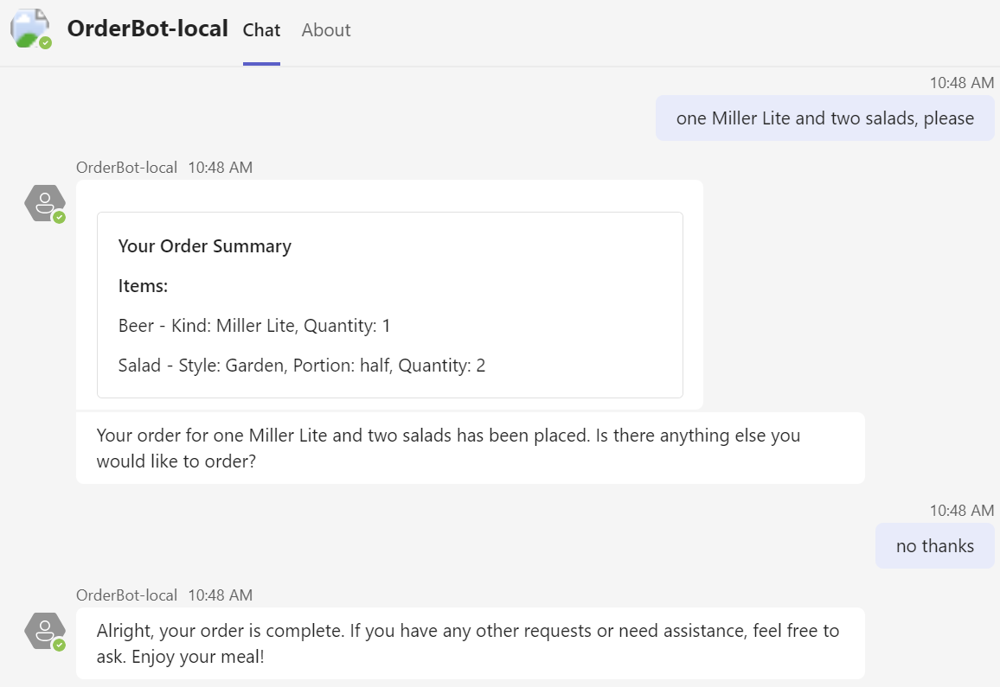

# Food Ordering Assistant

## Summary

This example shows how to create a conversational assistant that uses tools to call actions in your bots code. It's a food ordering assistant for a fictional restaurant called The Pub and is capable of complex interactions with the user as it takes their order.

## Set up instructions

All the samples in the C# .NET SDK can be set up in the same way. You can find the step by step instructions here: [Setup Instructions](../README.md).

Note that, this sample requires AI service and Assistant so you need pre-steps before Local Debug (F5).

**Create new OpenAI Assistant (You can skip this step if already have one Assistant)**

1. Set your OpenAI API key to *appsettings.Development.json*.

    ```json
      "OpenAI": {
        "ApiKey": "<your-openai-api-key>"
      }
    ```
1. Run the code and it will create an OpenAI Assistant and output it's ID to console.

**Use OpenAI Assistant**

1. Set your OpenAI API key and Assistant ID to *appsettings.Development.json*.

    ```json
      "OpenAI": {
        "ApiKey": "<your-openai-api-key>",
        "AssistantId": "<your-openai-assistant-id>"
      }
    ```

1. Now you can run/debug project as Teams App.

## Interacting with the bot



Interacting with the bot is simple - talk to it! You can invoke it by using @ mention and talk to it in plain language.

## Deploy to Azure

You can use Teams Toolkit for Visual Studio or CLI to host the bot in Azure. The sample includes Bicep templates in the `/infra` directory which are used by the tools to create resources in Azure.

You can find deployment instructions [here](../README.md#deploy-to-azure).

Note that, this sample requires AI service so you need one more pre-step before deploy to Azure. To configure the Azure resources to have an environment variable for the OpenAI Key and other settings:

1. In `./env/.env.dev.user` file, paste your OpenAI related variables.

    ```bash
    SECRET_OPENAI_API_KEY=
    SECRET_OPENAI_ASSISTANT_ID=
    ```

The `SECRET_` prefix is a convention used by Teams Toolkit to mask the value in any logging output and is optional.

## Appendix

Here's a list of the different capabilities shown in this sample:

<details close>
    <summary><h5>Bot scaffolding</h5></summary>
    Throughout the 'Program.cs' file you'll see the scaffolding created to run a simple conversational bot, e.g. storage, authentication, and conversation state.
</details>

<details close>
    <summary><h5>Localization across languages</h5></summary>
    Because this sample leverages GPT for all its natural language modelling, the user can talk to an AI bot in any language of their choosing. The bot will understand and respond appropriately with no additional code required.
</details>

## Further reading

- [Teams Toolkit overview](https://aka.ms/vs-teams-toolkit-getting-started)
- [How Microsoft Teams bots work](https://docs.microsoft.com/en-us/azure/bot-service/bot-builder-basics-teams?view=azure-bot-service-4.0&tabs=csharp)
