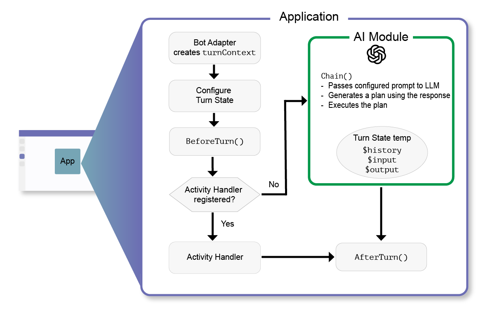

# Activity Routing

<small>Getting started directory</small>

1. [Migration](./00.MIGRATION.md)
2. [AI Setup](./01.AI-SETUP.md)
3. [**Activity Routing**](./02.ACTIVITY-ROUTING.md)
4. [QNA](./03.QNA.md)
5. [Other](../OTHER/README.md)

When an incoming activity reaches the server, the bot adapter handles the necessary authentication and creates a `TurnContext` object that encapsulates the activity details. It then calls the `Application.run` method. This is the entry point method of the application. Here's what happens in this method:

1. If configured in the application options, pulses of the `Typing` activity are sent to the user.
2. If configured in the application options, the @mention is removed from the incoming message activity.
3. The turn state is loaded using the configured turn state manager.
4. The `beforeTurn` activity handlers are executed. If it returns false, save turn state to storage and end the turn.
5. Then the activity handlers with the triggered selector functions are executed. If it returns false, save turn state to storage and end the turn.
6. If configued, and the incomming activity is `Message`, then call the `AI.chain` method.
7. Then `afterTurn` activity handlers are executed. If it return true, save turn state to storage.

These seven steps happen every time an incoming activity is received by the server.

Here's a diagram of the turn flow:

