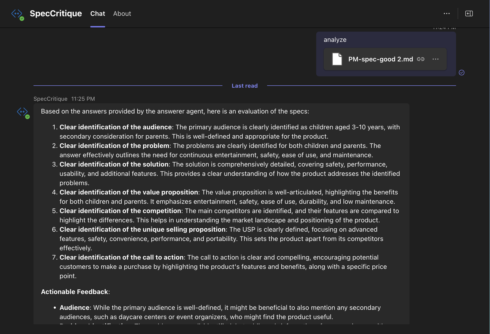

## Teams Autogen Bot

This is a simple project that demonstrates the use of [autogen](https://github.com/microsoft/autogen) in the context of a Microsoft Teams AI bot.
This bot models a product-spec critiquing team. 

The team consists of:
1. A questioner agent - the role of this agent is to ask questions based on some criteria for product specs at a company.
2. An answerer agent - the role of this agent is to answer the questions asked by the questioner agent based on a product spec
3. An evaluator agent - the role of this agent is to evaluate the answers given by the answerer agent based on the criteria given by the questioner agent.

The result from the evaluator agent is sent back to the Teams user. We also send back an adaptive card that contains the full transcript of the back-and-forth between the agents.

<!-- @import "[TOC]" {cmd="toc" depthFrom=1 depthTo=6 orderedList=false} -->

<!-- code_chunk_output -->

- [Teams Autogen Bot](#teams-autogen-bot)
  - [Interacting with the bot](#interacting-with-the-bot)
  - [Setting up the sample](#setting-up-the-sample)
  - [Testing the sample](#testing-the-sample)
    - [Using Teams Toolkit for Visual Studio Code](#using-teams-toolkit-for-visual-studio-code)

<!-- /code_chunk_output -->

## Interacting with the bot

You can interact with the bot by messaging it.



## Setting up the sample

1. Clone the repository

    ```bash
    git clone https://github.com/Microsoft/teams-ai.git
    ```

2. Duplicate the `sample.env` in the `teams-ai/python/samples/04.ai.g.autogen.product-spec-critique` folder. Rename the file to `.env`. 

3. Update .env. Make sure it includes either `OPENAI_KEY` or `AZURE_OPENAI_API_KEY` with `AZURE_OPENAI_ENDPOINT`. If you look for `build_llm_config` in the code, you will see how it builds the config for the model. You may need to modify it to suit your needs.

## Testing the sample

The easiest and fastest way to get up and running is with Teams Toolkit as your development guide. To use Teams Toolkit to automate setup and debugging, please [continue below](#using-teams-toolkit-for-visual-studio-code).

Otherwise, if you only want to run the bot locally and build manually, please jump to the [Bot Framework Emulator](../README.md#testing-in-botframework-emulator) section.
For different ways to test a sample see: [Multiple ways to test](../README.md#multiple-ways-to-test)

### Using Teams Toolkit for Visual Studio Code 

The simplest way to run this sample in Teams is to use Teams Toolkit for Visual Studio Code.

1. Ensure you have downloaded and installed [Visual Studio Code](https://code.visualstudio.com/docs/setup/setup-overview)
2. Install the [Teams Toolkit extension](https://marketplace.visualstudio.com/items?itemName=TeamsDevApp.ms-teams-vscode-extension)
3. Install the [Python extension](https://marketplace.visualstudio.com/items?itemName=ms-python.python)
4. Install [Poetry](https://python-poetry.org/docs/#installation)
5. Select **File > Open Folder** in VS Code and choose this sample's directory from the repo
6. Using the extension, sign in with your Microsoft 365 account where you have permissions to upload custom apps
7. Ensure that you have set up the sample from the previous step.
8. Trigger **Python: Create Environment** from command palette and create a virtual environment
9. Select **Debug > Start Debugging** or **F5** to run the app in a Teams web client.
10. In the browser that launches, select the **Add** button to install the app to Teams.

> If you do not have permission to upload custom apps (sideloading), Teams Toolkit will recommend creating and using a Microsoft 365 Developer Program account - a free program to get your own dev environment sandbox that includes Teams.
