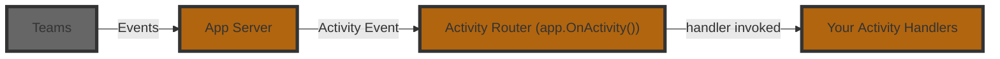

import Tabs from '@theme/Tabs';
import TabItem from '@theme/TabItem';

# Listening To Activities

An **Activity** is the Teams‑specific payload that flows between the user and your bot.  
Where _events_ describe high‑level happenings inside your app, _activities_ are the raw Teams messages such as chat text, card actions, installs, or invoke calls.  
The Teams AI Library v2 exposes a fluent router so you can subscribe to these activities with `app.OnActivity(...)`, or you can use controllers/attributes.



Here is an example of a basic message handler:

<Tabs>
  <TabItem label="Controller" value="controller" default>
    ```csharp 
    [TeamsController]
    public class MainController
    {
        [Message]
        public async Task OnMessage([Context] MessageActivity activity, [Context] IContext.Client client)
        {
            await client.Send($"you said: {activity.Text}");
        }
    }
    ```
  </TabItem>
  <TabItem label="Minimal" value="minimal">
    ```csharp 
    app.OnMessage(async context =>
    {
        await context.Send($"you said: {context.activity.Text}");
    });
    ```
  </TabItem>
</Tabs>

In the above example, the `activity` parameter is of type `MessageActivity`, which has a `Text` property. You'll notice that the handler here does not return anything, but instead handles it by `send`ing a message back. For message activities, Teams does not expect your application to return anything (though it's usually a good idea to send some sort of friendly acknowledgment!).

## Middleware pattern

The `OnActivity` activity handlers (and attributes) follow a [middleware](https://www.patterns.dev/vanilla/mediator-pattern/) pattern similar to how `dotnet` middlewares work. This means that for each activity handler, a `Next` function is passed in which can be called to pass control to the next handler. This allows you to build a chain of handlers that can process the same activity in different ways.

<Tabs>
  <TabItem label="Controller" value="controller" default>
    ```csharp 
    [Message]
    public void OnMessage([Context] MessageActivity activity, [Context] ILogger logger, [Context] IContext.Next next)
    {
        Console.WriteLine("global logger");
        next(); // pass control onward
    }
    ```
  </TabItem>
  <TabItem label="Minimal" value="minimal">
    ```csharp 
    app.OnMessage(async context =>
    {
        Console.WriteLine("global logger");
        context.Next(); // pass control onward
        return Task.CompletedTask;
    });
    ```
  </TabItem>
</Tabs>

<Tabs>
  <TabItem label="Controller" value="controller" default>
    ```csharp 
    [Message]
    public async Task OnMessage(IContext<MessageActivity> context)
    {
        if (context.Activity.Text == "/help")
        {
            await context.Send("Here are all the ways I can help you...");
        }

        // Conditionally pass control to the next handler
        context.Next();
    }
    ```
  </TabItem>
  <TabItem label="Minimal" value="minimal">
    ```csharp 
    app.OnMessage(async context =>
    {
        if (context.Activity.Text == "/help")
        {
            await context.Send("Here are all the ways I can help you...");
        }

        // Conditionally pass control to the next handler
        context.Next();
    });
    ```
  </TabItem>
</Tabs>

<Tabs>
  <TabItem label="Controller" value="controller" default>
    ```csharp 
    [Message]
    public async Task OnMessage(IContext<MessageActivity> context)
    {
        // Fallthrough to the final handler
        await context.Send($"Hello! you said {context.Activity.Text}");
    }
    ```
  </TabItem>
  <TabItem label="Minimal" value="minimal">
    ```csharp 
    app.OnMessage(async context =>
    {
        // Fallthrough to the final handler
        await context.Send($"Hello! you said {context.Activity.Text}");
    });
    ```
  </TabItem>
</Tabs>

:::info
Just like other middlewares, if you stop the chain by not calling `next()`, the activity will not be passed to the next handler.
:::
