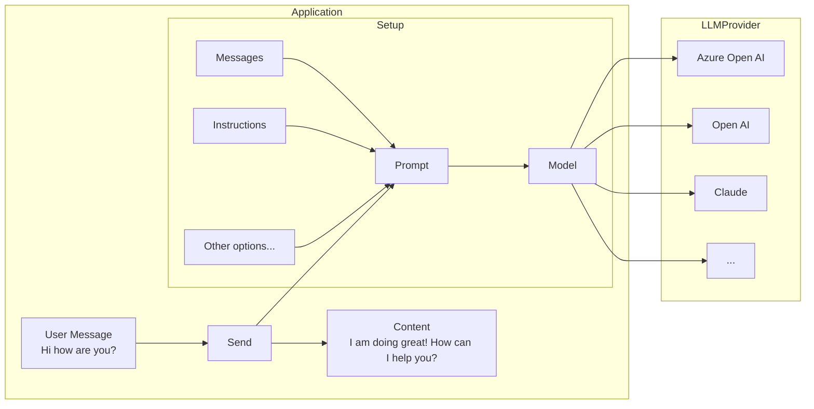

# 💬 Chat Generation

Before going through this guide, please make sure you have completed the [setup and prerequisites](./setup-and-prereqs.md) guide.

# Setup

The basic setup involves creating a `ChatPrompt` and giving it the `Model` you want to use.



## Simple chat generation

Chat generation is the the most basic way of interacting with an LLM model. It involves setting up your ChatPrompt, the Model, and sending it the message.

### Imperative Approach

Import the relevant namespaces:
```csharp
// AI
using Microsoft.Teams.AI.Models.OpenAI;
using Microsoft.Teams.AI.Prompts;
// Teams
using Microsoft.Teams.Api.Activities;
using Microsoft.Teams.Apps;
using Microsoft.Teams.Apps.Activities;
using Microsoft.Teams.Apps.Annotations;
```

Create a ChatModel, ChatPrompt, and handle user - LLM interactions:

```csharp
using Microsoft.Teams.AI.Models.OpenAI;
using Microsoft.Teams.AI.Prompts;
using Microsoft.Teams.AI.Templates;
using Microsoft.Teams.Api.Activities;
using Microsoft.Teams.Apps.Activities;
using Azure.AI.OpenAI;
using System.ClientModel;

// Configuration
var azureOpenAIModel = configuration["AzureOpenAIModel"]!;
var azureOpenAIEndpoint = configuration["AzureOpenAIEndpoint"]!;
var azureOpenAIKey = configuration["AzureOpenAIKey"]!;

var azureOpenAI = new AzureOpenAIClient(
    new Uri(azureOpenAIEndpoint),
    new ApiKeyCredential(azureOpenAIKey)
);

// AI Model
var aiModel = new OpenAIChatModel(azureOpenAIModel, azureOpenAI);

// Simple chat handler
teamsApp.OnMessage(async (context) =>
{
    var prompt = new OpenAIChatPrompt(aiModel, new ChatPromptOptions
    {
        Instructions = new StringTemplate("You are a friendly assistant who talks like a pirate")
    });

    var result = await prompt.Send(context.Activity.Text);
    if (result.Content != null)
    {
        var messageActivity = new MessageActivity
        {
            Text = result.Content,
        }.AddAIGenerated();
        await context.Send(messageActivity);
        // Ahoy, matey! 🏴‍☠️ How be ye doin' this fine day on th' high seas? What can this ol' salty sea dog help ye with? 🚢☠️
    }
});
```

### Declarative Approach

This approach uses attributes to declare prompts, providing clean separation of concerns.

**Create a Prompt Class:**

```csharp
using Microsoft.Teams.AI.Annotations;

namespace Samples.AI.Prompts;

[Prompt]
[Prompt.Description("A friendly pirate assistant")]
[Prompt.Instructions("You are a friendly assistant who talks like a pirate")]
public class PiratePrompt
{
}
```

**Usage in Program.cs:**

```csharp
using Microsoft.Teams.AI.Models.OpenAI;
using Microsoft.Teams.Api.Activities;

// Create the AI model
var aiModel = new OpenAIChatModel(azureOpenAIModel, azureOpenAI);

// Use the prompt with OpenAIChatPrompt.From()
teamsApp.OnMessage(async (context) =>
{
    var prompt = OpenAIChatPrompt.From(aiModel, new Samples.AI.Prompts.PiratePrompt());

    var result = await prompt.Send(context.Activity.Text);

    if (!string.IsNullOrEmpty(result.Content))
    {
        await context.Send(new MessageActivity { Text = result.Content }.AddAIGenerated());
        // Ahoy, matey! 🏴‍☠️ How be ye doin' this fine day on th' high seas?
    }
});
```

:::note
The current `OpenAIChatModel` implementation uses chat-completions API. The responses API is coming soon.
:::

## Streaming chat responses

LLMs can take a while to generate a response, so often streaming the response leads to a better, more responsive user experience.

:::warning
Streaming is only currently supported for single 1:1 chats, and not for groups or channels.
:::

```csharp
// Streaming handler
teamsApp.OnMessage(async (context) =>
{
    var match = Regex.Match(context.Activity.Text ?? "", @"^stream\s+(.+)", RegexOptions.IgnoreCase);
    if (match.Success)
    {
        var query = match.Groups[1].Value.Trim();
        var prompt = new OpenAIChatPrompt(aiModel, new ChatPromptOptions
        {
            Instructions = new StringTemplate("You are a friendly assistant who responds in extremely verbose language")
        });

        var result = await prompt.Send(query, (chunk) =>
        {
            context.Stream.Emit(chunk);
            return Task.CompletedTask;
        });
    }
});
```
### User experience

