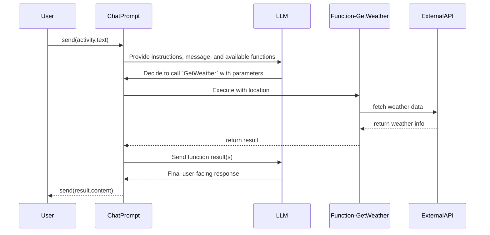

# Functions

It's possible to hook up functions that the LLM can decide to call if it thinks it can help with the task at hand. This is done by creating a class with the [`[Prompt]`](https://github.com/microsoft/teams.net/blob/main/Libraries/Microsoft.Teams.AI/Annotations/PromptAttribute.cs) attribute and adding functions with the [`[Function]`](https://github.com/microsoft/teams.net/blob/main/Libraries/Microsoft.Teams.AI/Annotations/FunctionAttribute.cs) attribute.



## Single Function Example

Here's a complete example showing how to create a weather function that the LLM can call:

**WeatherPrompt.cs**
```csharp
using Microsoft.Teams.AI.Annotations;
using Microsoft.Teams.Api.Activities;
using Microsoft.Teams.Apps;

namespace WeatherApp;

[Prompt]
[Prompt.Description("Provide weather information for locations")]
[Prompt.Instructions(
    "You are a helpful weather assistant.",
    "You can get current weather information for any location.",
    "Always provide temperature in both Celsius and Fahrenheit."
)]
public class WeatherPrompt(IContext.Accessor accessor)
{
    private IContext<IActivity> context => accessor.Value!;

    [Function]
    [Function.Description("Get the current weather for a specific location")]
    public async Task<string> GetWeather(
        [Param("The city and state/country, e.g. 'San Francisco, CA' or 'London, UK'")]
        string location)
    {
        // In a real implementation, you would call a weather API
        // For demo purposes, we'll return mock data
        await Task.Delay(100); // Simulate API call
        
        return $"The weather in {location} is sunny with a temperature of 22°C (72°F). " +
               $"Humidity is 65% with light winds from the west at 10 km/h.";
    }
}
```

### Program Setup {#program-setup}

**Program.cs**
```csharp
using Microsoft.Teams.AI.Models.OpenAI.Extensions;
using Microsoft.Teams.Apps.Extensions;
using Microsoft.Teams.Plugins.AspNetCore.DevTools.Extensions;
using Microsoft.Teams.Plugins.AspNetCore.Extensions;

using WeatherApp;

var builder = WebApplication.CreateBuilder(args);
builder.Services.AddTransient<Controller>();
builder.AddTeams().AddTeamsDevTools().AddOpenAI<WeatherPrompt>();

var app = builder.Build();

app.UseTeams();
app.Run();
```

### Controller Implementation {#controller-implementation}

**Controller.cs**
```csharp
using Microsoft.Teams.AI.Models.OpenAI;
using Microsoft.Teams.Api.Activities;
using Microsoft.Teams.Apps;
using Microsoft.Teams.Apps.Activities;
using Microsoft.Teams.Apps.Annotations;

namespace WeatherApp;

[TeamsController("main")]
public class Controller(Func<OpenAIChatPrompt> prompt)
{
    [Message]
    public async Task OnMessage(IContext<MessageActivity> context)
    {
        // Send the user's message to the prompt and stream the response back
        await prompt().Send(context.Activity.Text, null, 
            (chunk) => Task.Run(() => context.Stream.Emit(chunk)));
    }
}
```

### How Dependency Injection Works

The dependency injection flow connects the prompt class with functions to the controller:

1. **Registration**: [`AddOpenAI<WeatherPrompt>()`](#program-setup) in `Program.cs` registers the `WeatherPrompt` class and creates an `OpenAIChatPrompt<WeatherPrompt>` instance
2. **Injection**: The controller constructor receives [`OpenAIChatPrompt<WeatherPrompt>`](#controller-implementation) which is automatically configured with the functions from `WeatherPrompt`
3. **Usage**: When [`prompt.Send()`](#controller-implementation) is called, the LLM has access to all functions defined in the `WeatherPrompt` class

The generic type parameter `<WeatherPrompt>` ensures type safety and connects the specific prompt class (with its functions) to the chat prompt instance used in the controller.

## Multiple functions

Additionally, for complex scenarios, you can add multiple functions to a single prompt class. The LLM will then decide which function to call based on the context of the conversation. The LLM can pick one or more functions to call before returning the final response.

**UtilityPrompt.cs**
```csharp
using Microsoft.Teams.AI.Annotations;
using Microsoft.Teams.Api.Activities;
using Microsoft.Teams.Apps;
using System.Data;

namespace UtilityApp;

[Prompt]
[Prompt.Description("Multi-purpose assistant with weather, time, and calculator functions")]
[Prompt.Instructions(
    "You are a helpful assistant with access to multiple utilities.",
    "You can get weather information, current time, and perform calculations.",
    "Use the appropriate function based on what the user is asking for."
)]
public class UtilityPrompt(IContext.Accessor accessor)
{
    private IContext<IActivity> context => accessor.Value!;

    [Function]
    [Function.Description("Get the current weather for a specific location")]
    public async Task<string> GetWeather(
        [Param("The city and state/country")] string location)
    {
        await Task.Delay(100); // Simulate API call
        return $"Weather in {location}: Sunny, 22°C (72°F), 65% humidity";
    }

    [Function]
    [Function.Description("Get the current date and time")]
    public string GetCurrentTime(
        [Param("Optional timezone, e.g. 'UTC', 'EST', 'PST'")] string? timezone = null)
    {
        var now = DateTime.Now;
        if (!string.IsNullOrEmpty(timezone))
        {
            // In a real implementation, you would handle timezone conversion
            return $"Current time ({timezone}): {now:yyyy-MM-dd HH:mm:ss}";
        }
        return $"Current time: {now:yyyy-MM-dd HH:mm:ss}";
    }

    [Function]
    [Function.Description("Calculate the result of a mathematical expression")]
    public string Calculate(
        [Param("Mathematical expression to evaluate, e.g. '2 + 2' or '10 * 5'")] 
        string expression)
    {
        try
        {
            // Simple calculator using DataTable.Compute
            var result = new DataTable().Compute(expression, null);
            return $"Result: {expression} = {result}";
        }
        catch (Exception ex)
        {
            return $"Error calculating '{expression}': {ex.Message}";
        }
    }

    [Function]
    [Function.Description("Convert temperature between Celsius and Fahrenheit")]
    public string ConvertTemperature(
        [Param("Temperature value to convert")] double temperature,
        [Param("Source unit: 'C' for Celsius or 'F' for Fahrenheit")] string fromUnit)
    {
        if (fromUnit.ToUpper() == "C")
        {
            var fahrenheit = (temperature * 9 / 5) + 32;
            return $"{temperature}°C = {fahrenheit:F1}°F";
        }
        else if (fromUnit.ToUpper() == "F")
        {
            var celsius = (temperature - 32) * 5 / 9;
            return $"{temperature}°F = {celsius:F1}°C";
        }
        else
        {
            return "Invalid unit. Use 'C' for Celsius or 'F' for Fahrenheit.";
        }
    }
}
```

**Program.cs**
```csharp
using Microsoft.Teams.AI.Models.OpenAI.Extensions;
using Microsoft.Teams.Apps.Extensions;
using Microsoft.Teams.Plugins.AspNetCore.Extensions;

using UtilityApp;

var builder = WebApplication.CreateBuilder(args);
builder.Services.AddSingleton<Controller>();
builder.AddTeams().AddOpenAI<UtilityPrompt>();

var app = builder.Build();

app.UseTeams();
app.Run();
```

**Controller.cs**
```csharp
using Microsoft.Teams.AI.Models.OpenAI;
using Microsoft.Teams.Api.Activities;
using Microsoft.Teams.Apps;
using Microsoft.Teams.Apps.Activities;
using Microsoft.Teams.Apps.Annotations;

namespace UtilityApp;

[TeamsController]
public class Controller(OpenAIChatPrompt<UtilityPrompt> prompt)
{
    [Message]
    public async Task OnMessage(IContext<MessageActivity> context)
    {
        var state = State.From(context);

        await prompt.Send(context.Activity.Text, new() { Messages = state.Messages },
            cancellationToken: context.CancellationToken);

        state.Save(context);
    }
}
```

## Stopping Functions Early

You'll notice that after the function responds, [`ChatPrompt`](https://github.com/microsoft/teams.net/blob/main/Libraries/Microsoft.Teams.AI/Prompts/ChatPrompt/ChatPrompt.cs) re-sends the response from the function invocation back to the LLM which responds back with the user-facing message. It's possible to prevent this "automatic" function calling by implementing an [`IChatPlugin`](https://github.com/microsoft/teams.net/blob/main/Libraries/Microsoft.Teams.AI/ChatPlugin.cs) and using the [`OnBeforeFunctionCall()`](https://github.com/microsoft/teams.net/blob/main/Libraries/Microsoft.Teams.AI/ChatPlugin.cs#L42) method to manually control function execution.

**FunctionControlPlugin.cs**
```csharp
using Microsoft.Teams.AI;
using Microsoft.Teams.AI.Functions;

namespace FunctionControlApp;

public class FunctionControlPlugin : IChatPlugin
{
    public Task<IMessage> OnBeforeSend<TOptions>(IChatPrompt<TOptions> prompt, IMessage message, TOptions? options = default, CancellationToken cancellationToken = default)
    {
        // Pass through without modification
        return Task.FromResult(message);
    }

    public Task<IMessage> OnAfterSend<TOptions>(IChatPrompt<TOptions> prompt, IMessage message, TOptions? options = default, CancellationToken cancellationToken = default)
    {
        // Pass through without modification
        return Task.FromResult(message);
    }

    public Task<FunctionCall> OnBeforeFunctionCall<TOptions>(IChatPrompt<TOptions> prompt, IFunction function, FunctionCall call, CancellationToken cancellationToken = default)
    {
        // You can modify the function call here or prevent it from executing
        // For example, add logging, validation, or conditional execution
        Console.WriteLine($"About to call function: {function.Name} with parameters: {call.Arguments}");
        
        // You could return null or throw an exception to prevent the function from being called
        // return Task.FromResult<FunctionCall>(null!); // This would stop the function from executing
        
        // Or modify the call parameters
        // call.Arguments = ModifyArguments(call.Arguments);
        
        return Task.FromResult(call);
    }

    public Task<object?> OnAfterFunctionCall<TOptions>(IChatPrompt<TOptions> prompt, IFunction function, FunctionCall call, object? output, CancellationToken cancellationToken = default)
    {
        // You can modify the function output here or handle the result
        Console.WriteLine($"Function {function.Name} returned: {output}");
        
        // You could modify the output before it's sent back to the LLM
        // return Task.FromResult<object?>(ModifyOutput(output));
        
        return Task.FromResult(output);
    }
}
```

**Program.cs with Plugin**
```csharp
using Microsoft.Teams.AI.Models.OpenAI.Extensions;
using Microsoft.Teams.Apps.Extensions;
using Microsoft.Teams.Plugins.AspNetCore.Extensions;

using FunctionControlApp;

var builder = WebApplication.CreateBuilder(args);
builder.Services.AddSingleton<Controller>();
builder.Services.AddSingleton<FunctionControlPlugin>();
builder.AddTeams().AddOpenAI<WeatherPrompt>();

var app = builder.Build();

// Register the plugin with the prompt
var serviceProvider = app.Services;
var prompt = serviceProvider.GetRequiredService<OpenAIChatPrompt<WeatherPrompt>>();
var plugin = serviceProvider.GetRequiredService<FunctionControlPlugin>();
prompt.Plugin(plugin);

app.UseTeams();
app.Run();
```

This approach gives you fine-grained control over function execution, allowing you to implement custom logic for validation, logging, conditional execution, or result modification before the response is sent back to the LLM.
