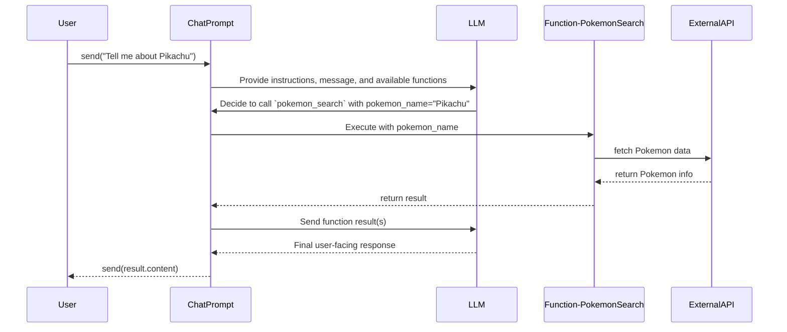

import Tabs from '@theme/Tabs';
import TabItem from '@theme/TabItem';

# Functions

It's possible to hook up functions that the LLM can decide to call if it thinks it can help with the task at hand. This is done by registering functions with a `ChatPrompt` using the `.Function()` method.



## Single Function Example

Here's a complete example showing how to create a Pokemon search function that the LLM can call.

<Tabs>
  <TabItem label="Imperative" value="imperative" default>
    ```csharp
    using System.Text.Json;
    using Microsoft.Teams.AI.Annotations;
    using Microsoft.Teams.AI.Models.OpenAI;
    using Microsoft.Teams.AI.Prompts;
    using Microsoft.Teams.AI.Templates;
    using Microsoft.Teams.Api.Activities;
    using Microsoft.Teams.Apps;

    /// <summary>
    /// Handle Pokemon search using PokeAPI
    /// </summary>
    public static async Task<string> PokemonSearchFunction([Param("pokemon_name")] string pokemonName)
    {
        try
        {
            using var client = new HttpClient();
            var response = await client.GetAsync($"https://pokeapi.co/api/v2/pokemon/{pokemonName.ToLower()}");

            if (!response.IsSuccessStatusCode)
            {
                return $"Pokemon '{pokemonName}' not found";
            }

            var json = await response.Content.ReadAsStringAsync();
            var data = JsonDocument.Parse(json);
            var root = data.RootElement;

            var name = root.GetProperty("name").GetString();
            var height = root.GetProperty("height").GetInt32();
            var weight = root.GetProperty("weight").GetInt32();
            var types = root.GetProperty("types")
                .EnumerateArray()
                .Select(t => t.GetProperty("type").GetProperty("name").GetString())
                .ToList();

            return $"Pokemon {name}: height={height}, weight={weight}, types={string.Join(", ", types)}";
        }
        catch (Exception ex)
        {
            return $"Error searching for Pokemon: {ex.Message}";
        }
    }

    /// <summary>
    /// Handle single function calling - Pokemon search
    /// </summary>
    public static async Task HandlePokemonSearch(OpenAIChatModel model, IContext<MessageActivity> context)
    {
        var prompt = new OpenAIChatPrompt(model, new ChatPromptOptions
        {
            Instructions = new StringTemplate("You are a helpful assistant that can look up Pokemon for the user.")
        });

        // Register the pokemon search function
        prompt.Function(
            "pokemon_search",
            "Search for pokemon information including height, weight, and types",
            PokemonSearchFunction
        );

        var result = await prompt.Send(context.Activity.Text);

        if (result.Content != null)
        {
            var message = new MessageActivity
            {
                Text = result.Content,
            }.AddAIGenerated();
            await context.Send(message);
        }
        else
        {
            await context.Reply("Sorry I could not find that pokemon");
        }
    }
    ```
  </TabItem>
  <TabItem label="Declarative" value="declarative">
    This approach uses attributes to declare prompts and functions, providing clean separation of concerns.

    **Create a Prompt Class:**

    ```csharp
    using System.Text.Json;
    using Microsoft.Teams.AI.Annotations;

    namespace Samples.AI.Prompts;

    [Prompt]
    [Prompt.Description("Pokemon search assistant")]
    [Prompt.Instructions("You are a helpful assistant that can look up Pokemon for the user.")]
    public class PokemonPrompt
    {
        [Function]
        [Function.Description("Search for pokemon information including height, weight, and types")]
        public async Task<string> PokemonSearch([Param("pokemon_name")] string pokemonName)
        {
            try
            {
                using var httpClient = new HttpClient();
                var response = await httpClient.GetAsync($"https://pokeapi.co/api/v2/pokemon/{pokemonName.ToLower()}");

                if (!response.IsSuccessStatusCode)
                {
                    return $"Pokemon '{pokemonName}' not found";
                }

                var json = await response.Content.ReadAsStringAsync();
                var data = JsonDocument.Parse(json);
                var root = data.RootElement;

                var name = root.GetProperty("name").GetString();
                var height = root.GetProperty("height").GetInt32();
                var weight = root.GetProperty("weight").GetInt32();
                var types = root.GetProperty("types")
                    .EnumerateArray()
                    .Select(t => t.GetProperty("type").GetProperty("name").GetString())
                    .ToList();

                return $"Pokemon {name}: height={height}, weight={weight}, types={string.Join(", ", types)}";
            }
            catch (Exception ex)
            {
                return $"Error searching for Pokemon: {ex.Message}";
            }
        }
    }
    ```

    **Usage in Program.cs:**

    ```csharp
    using Microsoft.Teams.AI.Models.OpenAI;
    using Microsoft.Teams.Api.Activities;

    // Create the AI model
    var aiModel = new OpenAIChatModel(azureOpenAIModel, azureOpenAI);

    // Use the prompt with OpenAIChatPrompt.From()
    teamsApp.OnMessage(async (context) =>
    {
        var prompt = OpenAIChatPrompt.From(aiModel, new Samples.AI.Prompts.PokemonPrompt());

        var result = await prompt.Send(context.Activity.Text);

        if (!string.IsNullOrEmpty(result.Content))
        {
            await context.Send(new MessageActivity { Text = result.Content }.AddAIGenerated());
        }
        else
        {
            await context.Reply("Sorry I could not find that pokemon");
        }
    });
    ```
  </TabItem>
</Tabs>

### How It Works

1. **Function Definition**: The function is defined as a regular C# method with parameters decorated with the `[Param]` attribute
2. **Automatic Schema Generation**: The library automatically generates the JSON schema for the function parameters using reflection
3. **Function Registration**:
   - **Imperative Approach**: The `.Function()` method registers the function with the prompt, providing the name, description, and handler
   - **Declarative Approach**: The `[Function]` attribute automatically registers methods when using `OpenAIChatPrompt.From()`
4. **Automatic Invocation**: When the LLM decides to call the function, it automatically:
   - Parses the function call arguments
   - Validates them against the schema
   - Invokes the handler
   - Returns the result back to the LLM

## Multiple Functions

Additionally, for complex scenarios, you can add multiple functions to the `ChatPrompt`. The LLM will then decide which function(s) to call based on the context of the conversation.

<Tabs>
  <TabItem label="Imperative" value="imperative" default>
    ```csharp
    /// <summary>
    /// Get user location (mock)
    /// </summary>
    public static string GetLocationFunction()
    {
        var locations = new[] { "Seattle", "San Francisco", "New York" };
        var random = new Random();
        var location = locations[random.Next(locations.Length)];
        return location;
    }

    /// <summary>
    /// Get weather for location (mock)
    /// </summary>
    public static string GetWeatherFunction([Param] string location)
    {
        var weatherByLocation = new Dictionary<string, (int Temperature, string Condition)>
        {
            ["Seattle"] = (65, "sunny"),
            ["San Francisco"] = (60, "foggy"),
            ["New York"] = (75, "rainy")
        };

        if (!weatherByLocation.TryGetValue(location, out var weather))
        {
            return "Sorry, I could not find the weather for that location";
        }

        return $"The weather in {location} is {weather.Condition} with a temperature of {weather.Temperature}°F";
    }

    /// <summary>
    /// Handle multiple function calling - location then weather
    /// </summary>
    public static async Task HandleMultipleFunctions(OpenAIChatModel model, IContext<MessageActivity> context)
    {
        var prompt = new OpenAIChatPrompt(model, new ChatPromptOptions
        {
            Instructions = new StringTemplate("You are a helpful assistant that can help the user get the weather. First get their location, then get the weather for that location.")
        });

        // Register both functions
        prompt.Function(
            "get_user_location",
            "Gets the location of the user",
            GetLocationFunction
        );

        prompt.Function(
            "weather_search",
            "Search for weather at a specific location",
            GetWeatherFunction
        );

        var result = await prompt.Send(context.Activity.Text);

        if (result.Content != null)
        {
            var message = new MessageActivity
            {
                Text = result.Content,
            }.AddAIGenerated();
            await context.Send(message);
        }
        else
        {
            await context.Reply("Sorry I could not figure it out");
        }
    }
    ```
  </TabItem>
  <TabItem label="Declarative" value="declarative">
    **Create a Prompt Class:**

    ```csharp
    using Microsoft.Teams.AI.Annotations;

    namespace Samples.AI.Prompts;

    [Prompt]
    [Prompt.Description("Weather assistant")]
    [Prompt.Instructions("You are a helpful assistant that can help the user get the weather. First get their location, then get the weather for that location.")]
    public class WeatherPrompt
    {
        [Function]
        [Function.Description("Gets the location of the user")]
        public string GetUserLocation()
        {
            var locations = new[] { "Seattle", "San Francisco", "New York" };
            var random = new Random();
            return locations[random.Next(locations.Length)];
        }

        [Function]
        [Function.Description("Search for weather at a specific location")]
        public string WeatherSearch([Param] string location)
        {
            var weatherByLocation = new Dictionary<string, (int Temperature, string Condition)>
            {
                ["Seattle"] = (65, "sunny"),
                ["San Francisco"] = (60, "foggy"),
                ["New York"] = (75, "rainy")
            };

            if (!weatherByLocation.TryGetValue(location, out var weather))
            {
                return "Sorry, I could not find the weather for that location";
            }

            return $"The weather in {location} is {weather.Condition} with a temperature of {weather.Temperature}°F";
        }
    }
    ```

    **Usage in Program.cs:**

    ```csharp
    using Microsoft.Teams.AI.Models.OpenAI;
    using Microsoft.Teams.Api.Activities;

    // Create the AI model
    var aiModel = new OpenAIChatModel(azureOpenAIModel, azureOpenAI);

    // Use the prompt with OpenAIChatPrompt.From()
    teamsApp.OnMessage(async (context) =>
    {
        var prompt = OpenAIChatPrompt.From(aiModel, new Samples.AI.Prompts.WeatherPrompt());

        var result = await prompt.Send(context.Activity.Text);

        if (!string.IsNullOrEmpty(result.Content))
        {
            await context.Send(new MessageActivity { Text = result.Content }.AddAIGenerated());
        }
        else
        {
            await context.Reply("Sorry I could not figure it out");
        }
    });
    ```
  </TabItem>
</Tabs>

### Multiple Function Execution Flow

When you register multiple functions:

1. The LLM receives information about all available functions
2. Based on the user's query, it decides which function(s) to call and in what order
3. For example, asking "What's the weather?" might trigger:
   - First: `get_user_location()` to determine where the user is
   - Then: `weather_search(location)` to get the weather for that location
4. The LLM combines all function results to generate the final response

:::tip
The LLM can call functions sequentially - using the output of one function as input to another - without any additional configuration. This makes it powerful for complex, multi-step workflows.
:::
