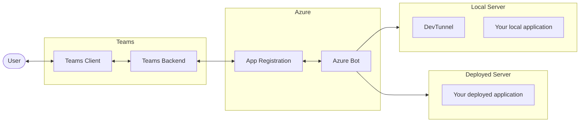

# Teams Core Concepts

When you run your agent on Teams using Microsoft 365 Agents Toolkit, several Teams-specific processes happen behind the scenes. Understanding these components will help you better debug and deploy your agents. Obviously, all these processes can be done manually, but Agents Toolkit automates them for you.

## Basic Flow

**Teams**

- Teams Client: User-facing agent that interacts with the user.
- Teams Backend: Part of your app package; includes a manifest with your app’s client ID.

**Azure**

- App Registration: Contains a unique client ID and secret for your app.
- Azure Bot: Connects your app to Teams; contains a pointer to your HTTPS URL.

**Local Server**

- Dev Tunnel: Public-facing HTTPS tunnel to expose your local machine.
- Local App: Your application running locally; handles events from Teams and sends responses.

**Deployed Server**

- Deployed App: Your app deployed to the cloud with a public HTTPS endpoint; also interacts with Teams.

## Core Concepts

When working with Teams, these are the key concepts. Keep in mind, this is a simplified view of the architecture.

- Teams Client: This is the Teams application where users interact with your agent. This can be the desktop app, web app, or mobile app.
- Teams Backend: This service handles all the Teams-related operations, including keeping a record of your manifest, and routing messages from your agent to the Azure bot service.
- App Registration: This is the registration of your agent in Azure. This Application Registration issues a unique client ID for your application and a client secret. This is used to authenticate your agent application with the Teams backend and other Azure services (including Graph if you are using it).
- Azure Bot Service: This is the service that handles all the bot-related operations, including routing messages from Teams to your agent and vice versa. This holds the URL to your agent application.
- DevTunnel: This is a service that creates a public facing URL to your locally running application. Azure Bot Service requires that you have a public facing https URL to your agent application.
- Local Agent Application: This is your agent application running on your local machine.
- Deployed Agent Application: This is your deployed agent which probably has a public facing URL.

## DevTunnel

[DevTunnel](https://learn.microsoft.com/en-us/azure/developer/dev-tunnels/overview) is a critical component that makes your locally running agent accessible to Teams. When you

:::info
DevTunnel is only one way of exposing your localling running service to the internet. Other tools like ngrok can also accomplish the same thing.
:::

- Creates a secure public HTTPS endpoint that forwards to your local server
- Manages SSL certificates automatically
- Routes Teams messages and events to your local agent

## Teams App Provisioning

Before your agent can interact with Teams, it needs to be properly registered and configured. This step handles creating or updating the App Registration and creating or registering the Azure Bot instance in Azure.

### App Registration

- Creates an App ID (i.e. Client ID) in the Teams platform
- Sets up a bot registration with the Bot Framework
- Creates a client secret that your agent can use to authenticate to be able to send and receive messages. Agents Toolkit will automatically get this value and store it in the `.env` file for you.

### Azure Bot

- Creates an Azure Bot resource
- Associates the bot with your App Registration
- Configures the messaging endpoint to point to your DevTunnel (or public URL if deployed)

## Sideloading Process

Sideloading is the process of installing your agent in Teams. You are able to pass in the manifest and icons (zipped up) to the Teams client. Sideloading an application automatically makes that application available to you. You are also able to sideload the application in a Team or a Group chat. In this case, the application will be available to all members of that Team or Group chat.

:::warning
Sideloading needs to be enabled in your tenant. If this is not the case, then you will need to contact your Teams administrator to enable it.
:::

## Provisioning and Deployment

To test your app in Teams, you will at minimum need to have a provisioned Azure bot. You are likely to have other provisionied resources such as storage. Please see the Microsoft Learn [Provision cloud resources](https://learn.microsoft.com/en-us/microsoftteams/platform/toolkit/provision) documentation for provisioning and deployment using Visual Studio Code and to a container service.