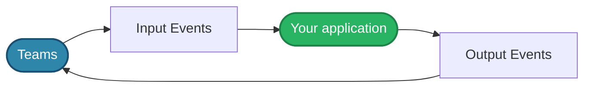
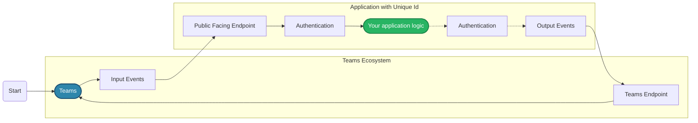
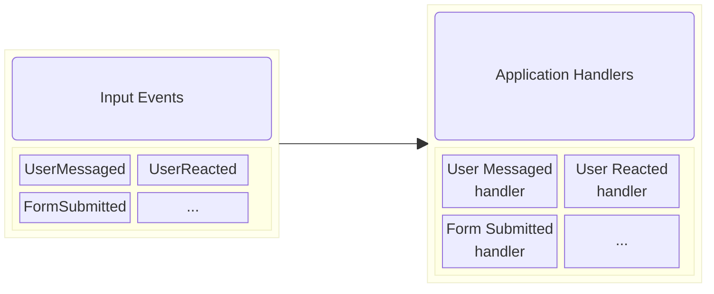
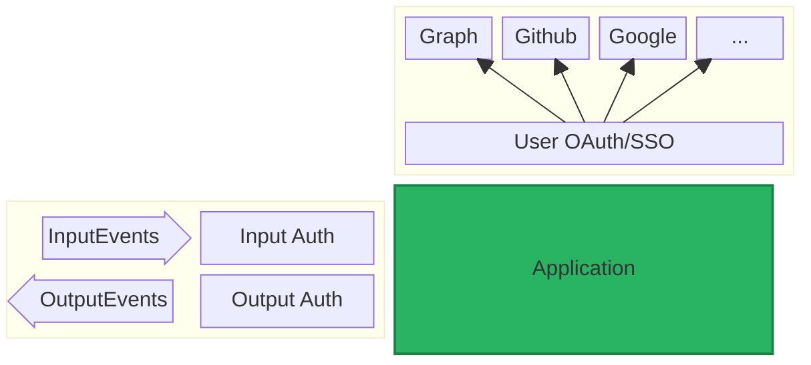

# Why An SDK?

Before getting into the basics, it's important to understand how an SDK can be helpful when building an agent application. For this, it's a good exercise to understand the basic messaging and event flow of a Teams agent application.

---

An agent application is mainly able to do two things:

1. Listen to events and respond to them
2. Proactively send messages to the user

To do this, we already need a few components:

1. A public facing URL to our agent application - This is so that the Teams backend knows where to send messages to when an interesting event happens.
2. A unique idenfier for our agent application - Teams doesn't like to pass around this URL everywhere. Instead it hides this information behind a unique ID. This way, if your URL changes, all you need to do is update the URL and keep the ID the same.
3. A way to authenticate to and from the Teams backend - This public facing URL may get hit in many different ways. We need some protections to make sure that the only messages that reach our main application are authenticated.

Next, once a request is successfully authenticated, there is a _slew_ of possible types of events that can be sent to your agent application. User messages, user reactions, installation events, Adaptive Card actions, dialog actions, and more. All of these get to your application through a single public door - the public facing URL. Not only this, but different types of events may expect a particular type of response back. For example, a message event may expect a text response or an Adaptive Card response, while a reaction event may not expect a response at all.

Now, it's possible for your own application to handle all the nuances with these events, but that would be a lot of work, and a lot of boilerplate code. Think, a gigantic switch statement at the very least.

Next, if you wanted to send messages to the user, you would need to make sure each call to the Teams backend is authenticated approriately for your application.

If your application wanted additional data from [Microsoft Graph](https://learn.microsoft.com/en-us/graph/overview), you would need to authenticate to that as well. Additionally, if you wanted the _user_ to authenticate and query Graph on their behalf, you would have to set up a solution to do the OAuth flow as well. For these complex flows, Teams offers a solution, but you must adhere to specific protocols and patterns to facilitate them.

As you can see, there are a lot of moving parts to building a Teams agent application. This is where the SDK comes in. The SDK abstracts away all of the boilerplate code and provides you with a simple interface to work with. It handles all the authentication, routing, and event handling for you, so you can focus on building your application.