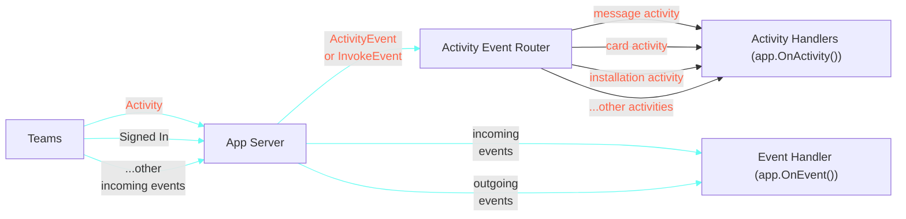

# Essentials

At its core, an application that hosts an agent on Microsoft Teams exists to do three things well: listen to events, handle the ones that matter, and respond efficiently. Whether a user sends a message, opens a dialog, or clicks a button — your app is there to interpret the event and act on it.

With Teams AI Library v2, we’ve made it easier than ever to build this kind of reactive, conversational logic. The library introduces a few simple but powerful paradigms to help you connect to Teams, register handlers, and build intelligent agent behaviors quickly.

Before diving in, let’s define a few key terms:

- Event: Anything interesting that happens on Teams — or within your application as a result of handling an earlier event.
- Activity: A special type of Teams-specific event. Activities include things like messages, reactions, and adaptive card actions.
- InvokeActivity: A specific kind of activity triggered by user interaction (like submitting a form), which may or may not require a response.
- Handler: The logic in your application that reacts to events or activities. Handlers decide what to do, when, and how to respond.

This section will walk you through the foundational pieces needed to build responsive, intelligent agents using the SDK.
