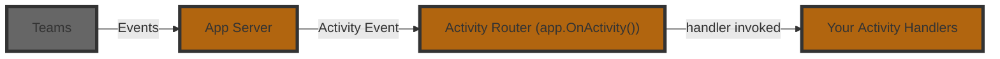

# Listening To Activities

An **Activity** is the Teams‑specific payload that flows between the user and your bot.  
Where _events_ describe high‑level happenings inside your app, _activities_ are the raw Teams messages such as chat text, card actions, installs, or invoke calls.  
The Teams AI Library v2 exposes a fluent router so you can subscribe to these activities with `@app.event("activity")`.



Here is an example of a basic message handler:

```python
@app.on_message
async def handle_message(ctx: ActivityContext[MessageActivity]):
    await ctx.send(f"You said '{ctx.activity.text}'")
```

In the above example, the `ctx.activity` parameter is of type `MessageActivity`, which has a `text` property. You'll notice that the handler here does not return anything, but instead handles it by `send`ing a message back. For message activities, Teams does not expect your application to return anything (though it's usually a good idea to send some sort of friendly acknowledgment!).

## Middleware pattern

The `event` activity handlers (and attributes) follow a [middleware](https://www.patterns.dev/vanilla/mediator-pattern/) pattern similar to how `python` middlewares work. This means that for each activity handler, a `next` function is passed in which can be called to pass control to the next handler. This allows you to build a chain of handlers that can process the same activity in different ways.

```python
@app.on_message
async def handle_message(ctx: ActivityContext[MessageActivity]):
    """Handle message activities using the new generated handler system."""
    print(f"[GENERATED onMessage] Message received: {ctx.activity.text}")
    await ctx.next()
```

```python
@app.on_message
async def handle_message(ctx: ActivityContext[MessageActivity]):
    """Handle message activities using the new generated handler system."""
    if ctx.activity.text == "/help":
        await ctx.send("Here are all the ways I can help you...")
    await ctx.next()
```

```python
@app.on_message
async def handle_message(ctx: ActivityContext[MessageActivity]):
    await ctx.send(f"You said '{ctx.activity.text}'")
```

:::info
Just like other middlewares, if you stop the chain by not calling `next()`, the activity will not be passed to the next handler.
The order of registration for the handlers also matters as that determines how the handlers will be called.
:::
