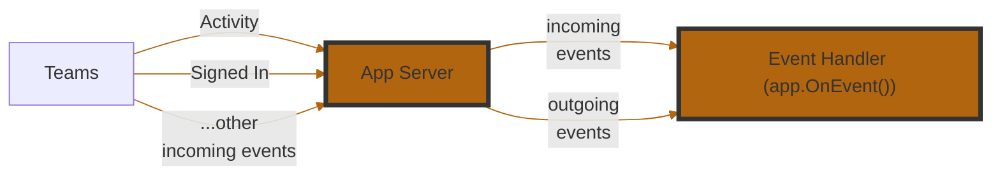

# Listening To Events

An **event** is a foundational concept in building agents — it represents something noteworthy happening either on Microsoft Teams or within your application. These events can originate from the user (e.g. installing or uninstalling your app, sending a message, submitting a form), or from your application server (e.g. startup, error in a handler).



The Teams AI Library v2 makes it easy to subscribe to these events and respond appropriately. You can register event handlers to take custom actions when specific events occur — such as logging errors, triggering workflows, or sending follow-up messages.

Here are the events that you can start building handlers for:

| **Event Name**      | **Description**                                                                |
| ------------------- | ------------------------------------------------------------------------------ |
| `start`             | Triggered when your application starts. Useful for setup or boot-time logging. |
| `sign_in`            | Triggered during a sign-in flow via Teams.                                     |
| `error`             | Triggered when an unhandled error occurs in your app. Great for diagnostics.   |
| `activity`          | A catch-all for incoming Teams activities (messages, commands, etc.).          |
| `activity_response` | Triggered when your app sends a response to an activity. Useful for logging.   |
| `activity_sent`     | Triggered when an activity is sent (not necessarily in response).              |

### Example 1

We can subscribe to errors that occur in the app.

```python
@app.event("error")
async def handle_error(event: ErrorEvent):
    """Handle error events."""
    print(f"Error occurred: {event.error}")
    if event.context:
        print(f"Context: {event.context}")
```

### Example 2

When an activity is received, log its payload.

```python
@app.event("activity")
async def handle_activity(event: ActivityEvent):
    """Handle activity events."""
    print(f"Activity received: {event.activity}")
```
