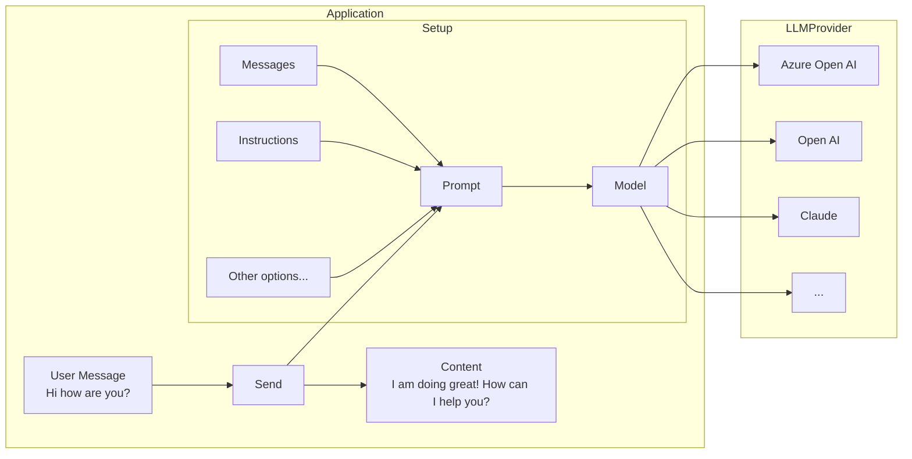

# 💬 Chat Generation

Before going through this guide, please make sure you have completed the [setup and prerequisites](./setup-and-prereqs.md) guide.

# Setup

The basic setup involves creating a `ChatPrompt` and giving it the `Model` you want to use.



## Simple chat generation

Chat generation is the the most basic way of interacting with an LLM model. It involves setting up your ChatPrompt, the Model, and sending it the message.

Import the relevant objects:

```python
from microsoft.teams.ai import ChatPrompt
from microsoft.teams.api import MessageActivity, MessageActivityInput
from microsoft.teams.apps import ActivityContext
from microsoft.teams.openai import OpenAICompletionsAIModel
```

```python

@app.on_message
async def handle_message(ctx: ActivityContext[MessageActivity]):
    openai_model = OpenAICompletionsAIModel(model=AZURE_OPENAI_MODEL)
    agent = ChatPrompt(model=openai_model)

    chat_result = await agent.send(
        input=ctx.activity.text,
        instructions="You are a friendly assistant who talks like a pirate."
    )
    result = chat_result.response
    if result.content:
        await ctx.send(MessageActivityInput(text=result.content).add_ai_generated())
        # Ahoy, matey! 🏴‍☠️ How be ye doin' this fine day on th' high seas? What can this ol’ salty sea dog help ye with? 🚢☠️
```

:::note
The current `OpenAICompletionsAIModel` implementation uses Chat Completions API. The Responses API is also available.
:::

## Agent

Instead of `ChatPrompt`, you may also use `Agent`. The `Agent` class is a derivation from `ChatPrompt` but it differs in that it's stateful. The `memory` object passed to the `Agent` object will be reused for subsequent calls to `send`, whereas for `ChatPrompt`, each call to `send` is independent.

## Streaming chat responses

LLMs can take a while to generate a response, so often streaming the response leads to a better, more responsive user experience.

:::warning
Streaming is only currently supported for single 1:1 chats, and not for groups or channels.
:::

```python
from microsoft.teams.ai import ChatPrompt
from microsoft.teams.api import MessageActivity, MessageActivityInput
from microsoft.teams.apps import ActivityContext
from microsoft.teams.openai import OpenAICompletionsAIModel
# ...

@app.on_message
async def handle_message(ctx: ActivityContext[MessageActivity]):
    openai_model = OpenAICompletionsAIModel(model=AZURE_OPENAI_MODEL)
    agent = ChatPrompt(model=openai_model)

    chat_result = await agent.send(
        input=ctx.activity.text,
        instructions="You are a friendly assistant who responds in terse language.",
        on_chunk=lambda chunk: ctx.stream.emit(chunk)
    )
    result = chat_result.response

    if ctx.activity.conversation.is_group:
        # If the conversation is a group chat, we need to send the final response
        # back to the group chat
        await ctx.send(MessageActivityInput(text=result.content).add_ai_generated())
    else:
        ctx.stream.emit(MessageActivityInput().add_ai_generated())
```


