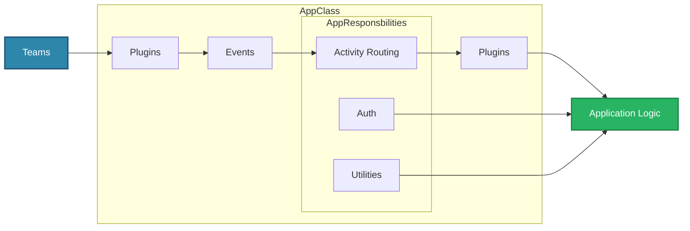

# App Basics

The `App` class is the main entry point for your agent.

It is responsible for:

1. Hosting and running the server (via plugins)
2. Serving incoming requests and routing them to your handlers
3. Handling authentication for your agent to the Teams backend
4. Providing helpful utilities which simplify the ability for your application to interact with the Teams platform
5. Managing plugins which can extend the functionality of your agent

## Core Components

**Plugins**

- Can be used to set up the server
- Can listen to messages or send messages out

**Events**

- Listens to events from core plugins
- Emit interesting events to the application

**Activity Routing**

- Routes activities to appropriate handlers

**Utilities**

- Provides utility functions for convenience (like sending replies or proactive messages)

**Auth**

- Handles authenticating your agent with Teams, Graph, etc.
- Simplifies the process of authenticating your app or user for your app

**Plugins (Secondary)**

- Can hook into activity handlers or proactive scenarios
- Can modify or update agent activity events

## Plugins

You'll notice that plugins are present in the front, which exposes your application as a server, and also in the back after the app does some processing to the incoming message. The plugin architecture allows the application to be built in an extremely modular way. Each plugin can be swapped out to change or augment the functionality of the application. The plugins can listen to various events that happen (e.g. the server starting or ending, an error occuring, etc), activities being sent to or from the application and more. This allows the application to be extremely flexible and extensible.
