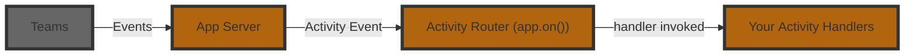

# Listening To Activities

An **Activity** is the Teams‑specific payload that flows between the user and your bot.  
Where _events_ describe high‑level happenings inside your app, _activities_ are the raw Teams messages such as chat text, card actions, installs, or invoke calls.  
The Teams AI Library v2 exposes a fluent router so you can subscribe to these activities with `app.on('<route>', …)`.



Here is an example of a basic message handler:

```typescript
app.on('message', async ({ activity, send }) => {
  await send(`You said: ${activity.text}`);
});
```

In the above example, the `activity` parameter is of type `MessageActivity`, which has a `text` property. You'll notice that the handler here does not return anything, but instead handles it by `send`ing a message back. For message activities, Teams does not expect your application to return anything (though it's usually a good idea to send some sort of friendly acknowledgment!).

[Other activity types](./activity-ref.md) have different properties and different required results. For a given handler, the library will automatically determine the type of `activity` and also enforce the correct return type. 

## Middleware pattern

The `on` activity handlers follow a [middleware](https://www.patterns.dev/vanilla/mediator-pattern/) pattern similar to how `express` middlewares work. This means that for each activity handler, a `next` function is passed in which can be called to pass control to the next handler. This allows you to build a chain of handlers that can process the same activity in different ways.

```typescript
app.on('message', async ({ next }) => {
  console.log('global logger');
  next(); // pass control onward
});
```

```typescript
app.on('message', async ({ activity, next }) => {
  if (activity.text === '/help') {
    await send('Here are all the ways I can help you...');
    return;
  }

  // Conditionally pass control to the next handler
  next();
});
```

```typescript
app.on('message', async ({ activity }) => {
  // Fallthrough to the final handler
  await send(`Hello! you said ${activity.text}`);
});
```

:::info
Just like other middlewares, if you stop the chain by not calling `next()`, the activity will not be passed to the next handler.
:::

## Activity Reference

For a list of supported activities that your application can listen to, see the [activity reference](./activity-ref.md).