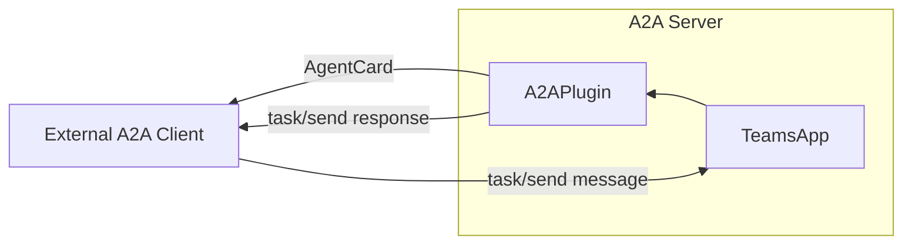
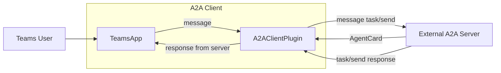

# A2A (Agent-to-Agent) Protocol

:::caution
This package is experimental and the A2A protocol is still in early development. Use with caution in production environments.
:::

[What is A2A?](https://google.github.io/A2A)

A2A (Agent-to-Agent) is a protocol designed to enable agents to communicate and collaborate programmatically. This package allows you to integrate the A2A protocol into your Teams app, making your agent accessible to other A2A clients and enabling your app to interact with other A2A servers.

Install the package:

```bash
npm install @microsoft/teams.a2a
```

## What does this package do?

-   Enables your Teams agent to act as an A2A server, exposing its capabilities to other agents.
-   Allows your Teams app to proactively reach out to other A2A servers as a client.

## High-level Architecture

### A2A Server


### A2A Client

