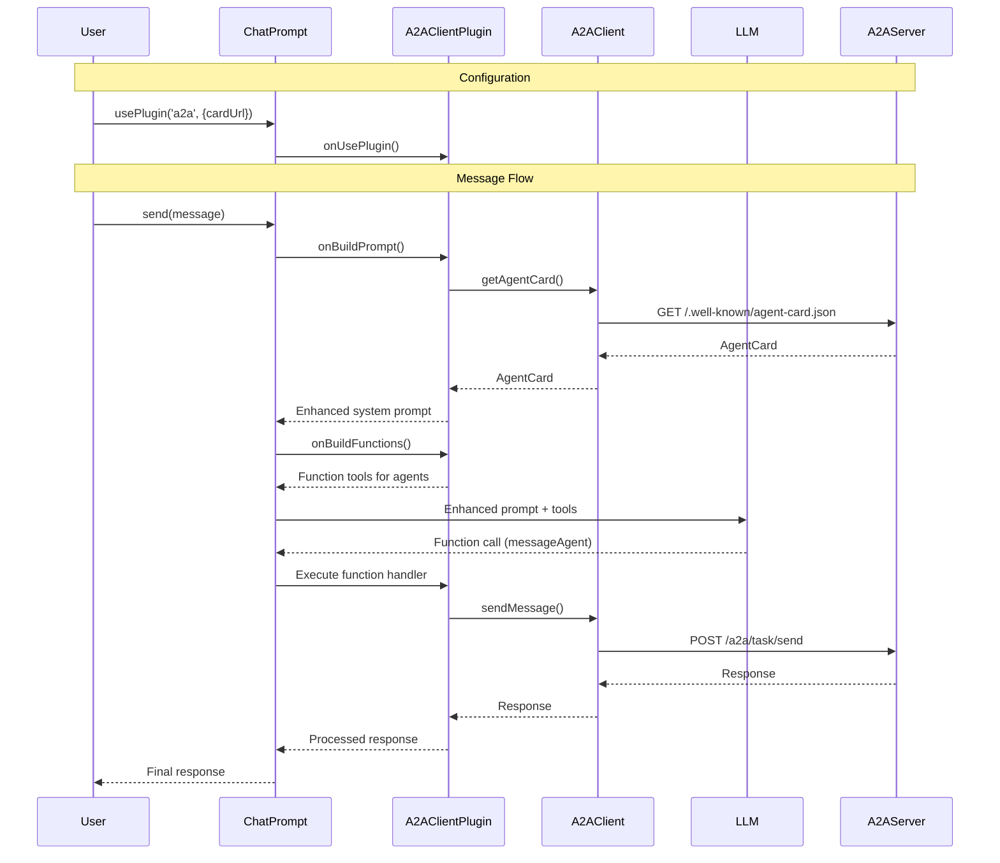

import FileCodeBlock from '@site/src/components/FileCodeBlock';

# A2A Client

## What is an A2A Client?

An A2A client is an agent or application that can proactively send tasks to A2A servers and interact with them using the A2A protocol.

## Using A2AClient Directly

For direct control over A2A interactions, you can use the `A2AClient` from the SDK:

```typescript
import { A2AClient } from '@a2a-js/sdk/client';

// Create client from agent card URL
const client = await A2AClient.fromCardUrl('http://localhost:4000/a2a/.well-known/agent-card.json');

// Send a message directly
const response = await client.sendMessage({
  message: {
    messageId: 'unique-id',
    role: 'user',
    parts: [{ kind: 'text', text: 'What is the weather?' }],
    kind: 'message'
  }
});
```

## Using A2AClientPlugin with ChatPrompt

A2A is most effective when used with an LLM. The `A2AClientPlugin` can be added to your chat prompt to allow interaction with A2A agents. Once added, the plugin will automatically configure the system prompt and tool calls to determine if the a2a server is needed for a particular task, and if so, it will do the work of orchestrating the call to the A2A server.

```typescript
import { A2AClientPlugin } from '@microsoft/teams.a2a';
import { ChatPrompt } from '@microsoft/teams.ai';
import { OpenAIChatModel } from '@microsoft/teams.openai';

const prompt = new ChatPrompt(
  {
    model: new OpenAIChatModel({
      apiKey: process.env.AZURE_OPENAI_API_KEY,
      model: process.env.AZURE_OPENAI_MODEL!,
      endpoint: process.env.AZURE_OPENAI_ENDPOINT,
      apiVersion: process.env.AZURE_OPENAI_API_VERSION
    }),
  },
  // Add the A2AClientPlugin to the prompt
  [new A2AClientPlugin()]
)
  // Provide the agent's card URL
  .usePlugin('a2a', {
    key: 'my-weather-agent',
    cardUrl: 'http://localhost:4000/a2a/.well-known/agent-card.json',
  });
```

To send a message:

```typescript
// Now we can send the message to the prompt and it will decide if
// the a2a agent should be used or not and also manages contacting the agent
const result = await prompt.send(message);
```

### Advanced A2AClientPlugin Configuration

You can customize how the client interacts with A2A agents by providing custom builders:

```typescript
// Example with custom message builders and response processors
export const advancedPrompt = new ChatPrompt(
  {
    model: new OpenAIChatModel({
      apiKey: process.env.AZURE_OPENAI_API_KEY,
      model: process.env.AZURE_OPENAI_MODEL!,
      endpoint: process.env.AZURE_OPENAI_ENDPOINT,
      apiVersion: process.env.AZURE_OPENAI_API_VERSION
    }),
  },
  [new A2AClientPlugin({
    // Custom function metadata builder
    buildFunctionMetadata: (card) => ({
      name: `ask${card.name.replace(/\s+/g, '')}`,
      description: `Ask ${card.name} about ${card.description || 'anything'}`,
    }),
    // Custom message builder - can return either Message or string
    buildMessageForAgent: (card, input) => {
      // Return a string - will be automatically wrapped in a Message
      return `[To ${card.name}]: ${input}`;
    },
    // Custom response processor
    buildMessageFromAgentResponse: (card, response) => {
      if (response.kind === 'message') {
        const textParts = response.parts
          .filter(part => part.kind === 'text')
          .map(part => part.text);
        return `${card.name} says: ${textParts.join(' ')}`;
      }
      return `${card.name} sent a non-text response.`;
    },
  })]
)
  .usePlugin('a2a', {
    key: 'weather-agent',
    cardUrl: 'http://localhost:4000/a2a/.well-known/agent-card.json',
  });
```


## Sequence Diagram

Here's how the A2A client works with `ChatPrompt` and `A2AClientPlugin`:



