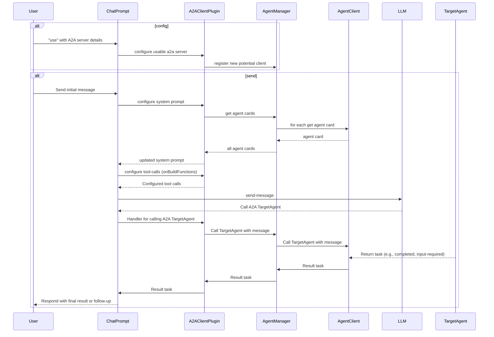

import FileCodeBlock from '@site/src/components/FileCodeBlock';

# A2A Client

## What is an A2A Client?

An A2A client is an agent or application that can proactively send tasks to A2A servers and interact with them using the A2A protocol.

## Using AgentManager to Call A2A Servers

You can use the `AgentManager` to register and send tasks to different A2A servers:

<FileCodeBlock
    lang="typescript"
    src="/generated-snippets/ts/client-example.snippet.a2a-client-directly-use-agent-manager-example.ts"
/>

## Using A2AClientPlugin with ChatPrompt

A2A is most effective when used with an LLM. The `A2AClientPlugin` can be added to your chat prompt to allow interaction with A2A agents. Once added, the plugin will automatically configure the system prompt and tool calls to determine if the a2a server is needed for a particular task, and if so, it will do the work of orchestrating the call to the A2A server.

<FileCodeBlock
    lang="typescript"
    src="/generated-snippets/ts/client-example.snippet.a2a-client-use-with-chat-prompt-example.ts"
/>
<FileCodeBlock
    lang="typescript"
    src="/generated-snippets/ts/client-example.snippet.a2a-client-use-with-chat-prompt-example-send.ts"
/>

## Sequence Diagram

To understand how the A2A client works with the `ChatPrompt`, `A2AClientPlugin`, and `AgentManager`, here is a sequence diagram that illustrates the flow of messages. The main thing to note is that the `A2AClientPlugin` has 3 main responsibilities:
1. Keep state of the A2A agents that it can call. It does so using the `AgentManager` described above.
2. Before sending a message to the LLM, it gets the agent cards for the required agents, and includes their descriptions in the system prompt.
3. It configures the tool calls for the LLM to decide if it needs to call a particular A2A agent.
4. If the LLM decides to call an A2A agent, the plugin will use the `AgentManager` to call the agent and return the result.

## Notes

-   This package and the A2A protocol are experimental.
-   Ensure you handle errors and edge cases when interacting with remote agents.

## Further Reading

-   [A2A Protocol](https://google.github.io/A2A) 