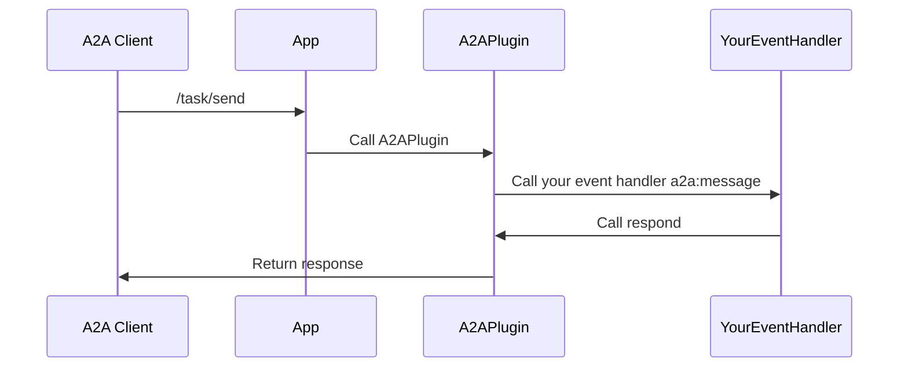

import FileCodeBlock from '@site/src/components/FileCodeBlock';

# A2A Server

## What is an A2A Server?
An A2A server is an agent that exposes its capabilities to other agents using the A2A protocol. With this package, you can make your Teams app accessible to A2A clients.

## Adding the A2APlugin

To enable A2A server functionality, add the `A2APlugin` to your Teams app and provide an `agentCard`:

<FileCodeBlock
    lang="typescript"
    src="/generated-snippets/ts/server-example.snippet.a2a-server-app-initialization-example.ts"
/>

## Agent Card Exposure

The plugin automatically exposes your agent card at the path `a2a/.well-known/agent.json`.

## Handling A2A Requests

Handle incoming A2A requests by adding an event handler for the `a2a:message` event. You may use `accumulateArtifacts` to iteratively accumulate artifacts for the task, or simply `respond` with the final result.

<FileCodeBlock
    lang="typescript"
    src="/generated-snippets/ts/server-example.snippet.a2a-server-event-handler-example.ts"
/>

:::note
-   You must have only a single handler that calls `respond`.
-   You **must** call `respond` as the last step in your handler. This resolves the open request to the caller.
:::

## Sequence Diagram

## Further Reading

-   [A2A Protocol](https://google.github.io/A2A) 
