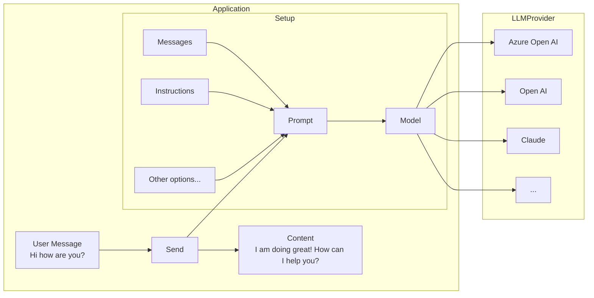

# 💬 Chat Generation

Before going through this guide, please make sure you have completed the [setup and prerequisites](./setup-and-prereqs.md) guide.

# Setup

The basic setup involves creating a `ChatPrompt` and giving it the `Model` you want to use.



## Simple chat generation

Chat generation is the the most basic way of interacting with an LLM model. It involves setting up your ChatPrompt, the Model, and sending it the message.

Import the relevant objects:

```typescript
import { OpenAIChatModel } from '@microsoft/teams.openai';
```

```typescript
import { ChatPrompt } from '@microsoft/teams.ai';
import { MessageActivity } from '@microsoft/teams.api';
import { App } from '@microsoft/teams.apps';
import { OpenAIChatModel } from '@microsoft/teams.openai';
// ...

app.on('message', async ({ send, activity, next, log }) => {
  const model = new OpenAIChatModel({
    apiKey: process.env.AZURE_OPENAI_API_KEY || process.env.OPENAI_API_KEY,
    endpoint: process.env.AZURE_OPENAI_ENDPOINT,
    apiVersion: process.env.AZURE_OPENAI_API_VERSION,
    model: process.env.AZURE_OPENAI_MODEL_DEPLOYMENT_NAME!,
  });

  const prompt = new ChatPrompt({
    instructions: 'You are a friendly assistant who talks like a pirate',
    model,
  });

  const response = await prompt.send(activity.text);
  if (response.content) {
    const activity = new MessageActivity(response.content).addAiGenerated();
    await send(activity);
    // Ahoy, matey! 🏴‍☠️ How be ye doin' this fine day on th' high seas? What can this ol' salty sea dog help ye with? 🚢☠️
  }
});
```

:::note
The current `OpenAIChatModel` implementation uses chat-completions API. The responses API is coming soon.
:::

## Streaming chat responses

LLMs can take a while to generate a response, so often streaming the response leads to a better, more responsive user experience.

:::warning
Streaming is only currently supported for single 1:1 chats, and not for groups or channels.
:::

```typescript
import { ChatPrompt } from '@microsoft/teams.ai';
import { MessageActivity } from '@microsoft/teams.api';
import { App } from '@microsoft/teams.apps';
// ...

app.on('message', async ({ stream, send, activity, next, log }) => {
  // const query = activity.text;

  const prompt = new ChatPrompt({
    instructions: 'You are a friendly assistant who responds in extremely verbose language',
    model,
  });

  // Notice that we don't `send` the final response back, but
  // `stream` the chunks as they come in
  const response = await prompt.send(query, {
    onChunk: (chunk) => {
      stream.emit(chunk);
    },
  });

  if (activity.conversation.isGroup) {
    // If the conversation is a group chat, we need to send the final response
    // back to the group chat
    const activity = new MessageActivity(response.content).addAiGenerated();
    await send(activity);
  } else {
    // We wrap the final response with an AI Generated indicator
    stream.emit(new MessageActivity().addAiGenerated());
  }
});
```


