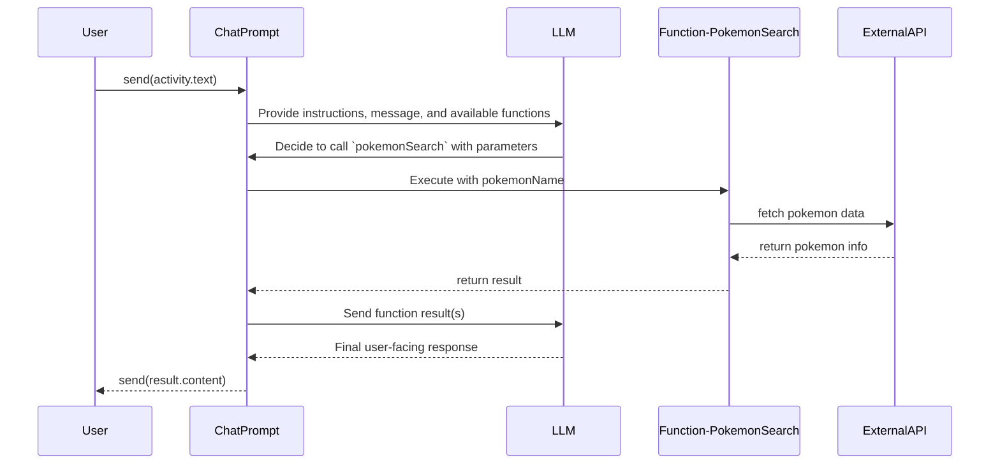

# Function / Tool Calling

It's possible to hook up functions that the LLM can decide to call if it thinks it can help with the task at hand. This is done by adding a `function` to the `ChatPrompt`.



```typescript
import { ChatPrompt, IChatModel } from '@microsoft/teams.ai';
import { ActivityLike, IMessageActivity } from '@microsoft/teams.api';
// ...

const prompt = new ChatPrompt({
  instructions: 'You are a helpful assistant that can look up Pokemon for the user.',
  model,
})
  // Include `function` as part of the prompt
  .function(
    'pokemonSearch',
    'search for pokemon',
    // Include the schema of the parameters
    // the LLM needs to return to call the function
    {
      type: 'object',
      properties: {
        pokemonName: {
          type: 'string',
          description: 'the name of the pokemon',
        },
      },
      required: ['text'],
    },
    // The cooresponding function will be called
    // automatically if the LLM decides to call this function
    async ({ pokemonName }: IPokemonSearch) => {
      log.info('Searching for pokemon', pokemonName);
      const response = await fetch(`https://pokeapi.co/api/v2/pokemon/${pokemonName}`);
      if (!response.ok) {
        throw new Error('Pokemon not found');
      }
      const data = await response.json();
      // The result of the function call is sent back to the LLM
      return {
        name: data.name,
        height: data.height,
        weight: data.weight,
        types: data.types.map((type: { type: { name: string } }) => type.type.name),
      };
    }
  );

// The LLM will then produce a final response to be sent back to the user
// activity.text could have text like 'pikachu'
const result = await prompt.send(activity.text);
await send(result.content ?? 'Sorry I could not find that pokemon');
```

## Multiple functions

Additionally, for complex scenarios, you can add multiple functions to the `ChatPrompt`. The LLM will then decide which function to call based on the context of the conversation. The LLM can pick one or more functions to call before returning the final response.

```typescript
import { ChatPrompt, IChatModel } from '@microsoft/teams.ai';
import { ActivityLike, IMessageActivity } from '@microsoft/teams.api';
// ...

// activity.text could be something like "what's my weather?"
// The LLM will need to first figure out the user's location
// Then pass that in to the weatherSearch
const prompt = new ChatPrompt({
  instructions: 'You are a helpful assistant that can help the user get the weather',
  model,
})
  // Include multiple `function`s as part of the prompt
  .function(
    'getUserLocation',
    'gets the location of the user',
    // This function doesn't need any parameters,
    // so we do not need to provide a schema
    async () => {
      const locations = ['Seattle', 'San Francisco', 'New York'];
      const randomIndex = Math.floor(Math.random() * locations.length);
      const location = locations[randomIndex];
      log.info('Found user location', location);
      return location;
    }
  )
  .function(
    'weatherSearch',
    'search for weather',
    {
      type: 'object',
      properties: {
        location: {
          type: 'string',
          description: 'the name of the location',
        },
      },
      required: ['location'],
    },
    async ({ location }: { location: string }) => {
      const weatherByLocation: Record<string, {}> = {
        Seattle: { temperature: 65, condition: 'sunny' },
        'San Francisco': { temperature: 60, condition: 'foggy' },
        'New York': { temperature: 75, condition: 'rainy' },
      };

      const weather = weatherByLocation[location];
      if (!weather) {
        return 'Sorry, I could not find the weather for that location';
      }

      log.info('Found weather', weather);
      return weather;
    }
  );

// The LLM will then produce a final response to be sent back to the user
const result = await prompt.send(activity.text);
await send(result.content ?? 'Sorry I could not figure it out');
```

## Stopping Functions early

You'll notice that after the function responds, `ChatPrompt` re-sends the response from the function invocation back to the LLM which responds back with the user-facing message. It's possible to prevent this "automatic" function calling by passing in a flag

```typescript
import { ChatPrompt, IChatModel, Message } from '@microsoft/teams.ai';
import { ActivityLike, IMessageActivity } from '@microsoft/teams.api';
// ...

const result = await prompt.send(activity.text, {
  autoFunctionCalling: false // Disable automatic function calling
});
// Extract the function call arguments from the result
const functionCallArgs = result.function_calls?.[0].arguments;

const firstCall = result.function_calls?.[0];
  const fnResult = actualFunction(firstCall.arguments);
  messages.push({
    role: 'function',
    function_id: firstCall.id,
    content: fnResult,
  });

  // Optionally, you can call the chat prompt again after updating the messages with the results
  const result = await prompt.send('What should we do next?', {
    messages,
    autoFunctionCalling: true // You can enable it here if you want
  });
  const functionCallArgs = result.function_calls?.[0].arguments; // Extract the function call arguments
  await send(`The LLM responed with the following structured output: ${JSON.stringify(functionCallArgs, undefined, 2)}.`);
```
