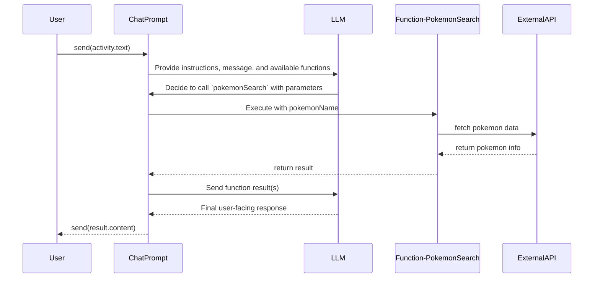

import FileCodeBlock from '@site/src/components/FileCodeBlock';

# Functions

It's possible to hook up functions that the LLM can decide to call if it thinks it can help with the task at hand. This is done by adding a `function` to the `ChatPrompt`.

<FileCodeBlock
    lang="typescript"
    src="/generated-snippets/ts/tool-calling.snippet.single-function-calling.ts"
/>

## Multiple functions

Additionally, for complex scenarios, you can add multiple functions to the `ChatPrompt`. The LLM will then decide which function to call based on the context of the conversation. The LLM can pick one or more functions to call before returning the final response.

<FileCodeBlock
    lang="typescript"
    src="/generated-snippets/ts/tool-calling.snippet.multiple-function-calling.ts"
/>

## Stopping Functions early

You'll notice that after the function responds, `ChatPrompt` re-sends the response from the function invocation back to the LLM which responds back with the user-facing message. It's possible to prevent this "automatic" function calling by passing in a flag

<FileCodeBlock
    lang="typescript"
    src="/generated-snippets/ts/structured-output.snippet.structured-output.ts"
/>