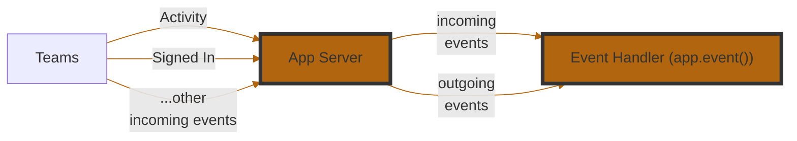

<!-- mermaid-diagram -->



<!-- events-table -->

| **Event Name**      | **Description**                                                                |
| ------------------- | ------------------------------------------------------------------------------ |
| `start`             | Triggered when your application starts. Useful for setup or boot-time logging. |
| `sign_in`           | Triggered during a sign-in flow via Teams.                                     |
| `error`             | Triggered when an unhandled error occurs in your app. Great for diagnostics.   |
| `activity`          | Triggered for all incoming Teams activities (messages, commands, etc.).        |
| `activity_response` | Triggered when your app sends a response to an activity. Useful for logging.   |
| `activity_sent`     | Triggered when an activity is sent (not necessarily in response).              |

<br/>
:::info
Event handler registration uses `@app.event("<event_name>")` with an async function that receives an event object specific to the event type (e.g., `ErrorEvent`, `ActivityEvent`).
:::

<!-- example-1 -->

```python
@app.event("error")
async def handle_error(event: ErrorEvent):
    print(f"Error occurred: {event.error}")
    # Or alternatively, send it to an observability platform
```

<!-- example-2 -->

When a user signs in using `OAuth` or `SSO`, use the Graph API to fetch their profile and say hello.

```python
from microsoft_teams.graph import get_graph_client

graph = app.add_oauth_flow("graph")

@graph.on_signin
async def handle_signin(event: SignInEvent):
    client = get_graph_client(event.token_response.token)
    me = await client.me.get()
    await event.activity_ctx.send(f"👋 Hello {me.display_name}")
```

:::tip
The app-wide `sign_in` event fires for every connection. To react to just one, use its flow's `@flow.on_signin` handler as shown above. See the [auth guide](../in-depth-guides/user-authentication).
:::
