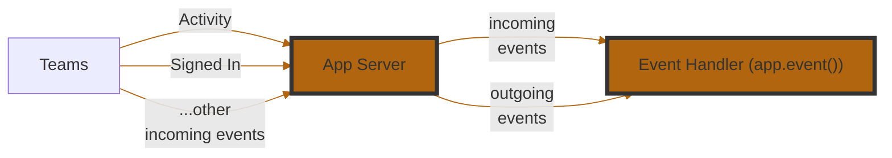

<!-- mermaid-diagram -->



<!-- events-table -->

| **Event Name**      | **Description**                                                                |
| ------------------- | ------------------------------------------------------------------------------ |
| `start`             | Triggered when your application starts. Useful for setup or boot-time logging. |
| `signin`            | Triggered during a sign-in flow via Teams.                                     |
| `error`             | Triggered when an unhandled error occurs in your app. Great for diagnostics.   |
| `activity`          | A catch-all for incoming Teams activities (messages, commands, etc.).          |
| `activity.response` | Triggered when your app sends a response to an activity. Useful for logging.   |
| `activity.sent`     | Triggered when an activity is sent (not necessarily in response).              |

<!-- example-1 -->

```typescript
app.event('error', ({ error }) => {
  app.log.error(error);
  // Or Alternatively, send it to an observability platform
});
```

<!-- example-2 -->

When a user signs in using `OAuth` or `SSO`, use the graph api to fetch their profile and say hello.

```typescript
import { Client as GraphClient } from '@microsoft/teams.graph';
import * as endpoints from '@microsoft/teams.graph-endpoints';

const graph = app.addOAuthFlow('graph');

graph.onSignInComplete(async (ctx, token) => {
  const client = new GraphClient({ token: () => token.token }, { baseUrlRoot: app.graphBaseUrl });
  const me = await client.call(endpoints.me.get);
  await ctx.send(`👋 Hello ${me.displayName}`);
});
```

:::tip
The app-wide `signin` event fires for every connection. To react to just one, use its flow's `onSignInComplete` callback as shown above. See the [auth guide](../in-depth-guides/user-authentication).
:::
