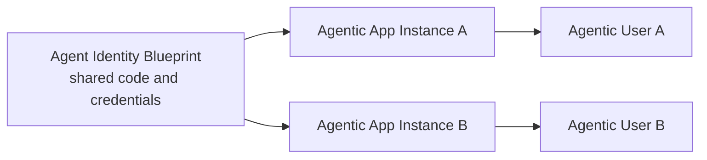

# Concepts and benefits

[Microsoft Agent 365](https://learn.microsoft.com/microsoft-agent-365/) is the control plane for AI agents across your organization. It gives agents identities and provides tools to deploy, observe, secure, and govern them across Microsoft 365.

Teams SDK provides the Activity Protocol and identity-aware messaging layer for Agent 365 agents in Teams. One reusable blueprint runtime can serve multiple app instances and Agentic Users while the SDK preserves the correct identity for messages, API calls, lifecycle events, and telemetry.

## Identity model

| Concept                      | Purpose                                                                                                                                              |
| ---------------------------- | ---------------------------------------------------------------------------------------------------------------------------------------------------- |
| **Agent Identity Blueprint** | The reusable application, credentials, permissions, and runtime that define an agent.                                                                |
| **Agentic App Instance**     | A concrete app or workload identity created from the blueprint.                                                                                      |
| **Agentic User (AU)**        | The Microsoft 365 user identity associated with an app instance. It can have a directory profile, manager, mailbox, permissions, and Teams presence. |
| **AgenticIdentity**          | The Teams SDK operation scope. It identifies the blueprint and can include the Agentic App and Agentic User used for an SDK operation.                |

One blueprint can power many agents. Your code uses the Agentic User and app instance IDs to load the correct configuration, state, and permissions for each agent.

`AgenticIdentity` is an SDK type, not another platform identity. Use it to scope proactive sends, API clients, and telemetry to the intended Agentic User. SDK operation types call the concrete app identifier the Agentic App ID.

For a deeper identity architecture overview, see [Plan an agent identity architecture](https://learn.microsoft.com/entra/agent-id/how-to-plan-agent-identity-architecture).

## How Agent 365 compares to a standard bot

Agent 365 uses the same Teams activity and app authentication model as a standard bot. The main difference is how the app represents and selects the identity that interacts with users.

| Standard bot                                          | Agent 365                                                                                    |
| ----------------------------------------------------- | -------------------------------------------------------------------------------------------- |
| The application client ID identifies the bot app.     | The Blueprint ID is the application client ID and identifies the reusable agent application. |
| One bot identity represents the app in conversations. | One blueprint can support multiple Agentic App Instances and Agentic Users.                  |
| Replies use the bot identity configured for the app.  | Replies use the Agentic User from the incoming activity.                                     |
| Proactive messages use the bot's configured identity. | Proactive messages select the Agentic User that sends the message.                           |

Your existing handlers and activity processing remain the same. Agent 365 adds an identity scope so the SDK can act as the correct Agentic User.

## Benefits

- **Separate Microsoft 365 identity:** Represent an Agentic User as a distinct teammate instead of sharing the blueprint application's identity.
- **Identity-aware permissions:** Use the concrete agent identity and its permissions instead of giving every agent the same broad application permissions.
- **Clear attribution:** Attribute actions to the acting identity in telemetry and governance systems.
- **Reusable implementation:** Serve many Agentic Users from one runtime while keeping separate configuration, memory, ownership, and business context.
- **Managed lifecycle:** Respond when an Agentic User is created, changed, enabled, disabled, deleted, restored, or onboarded to a workload.
- **Connected observability and governance:** Connect application traces with Microsoft 365 monitoring, investigation, and administration tools.
