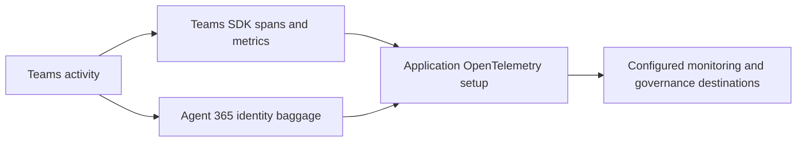

# Observability and governance

Agent 365 observability has three layers:

1. **Teams SDK telemetry** records normal activity processing, handler, authentication, API, and state operations.
2. **Agent 365 [baggage](https://opentelemetry.io/docs/concepts/signals/baggage/)** adds identity and correlation context to child [spans](https://opentelemetry.io/docs/concepts/signals/traces/#spans).
3. **Application telemetry setup** creates Agent 365 scopes and configures the Microsoft [OpenTelemetry distribution](https://opentelemetry.io/docs/concepts/distributions/) and [exporters](https://opentelemetry.io/docs/concepts/components/#exporters).

The SDK establishes correlation context for reactive operations. For proactive work, open a scope with the selected `AgenticIdentity` before creating the span that represents the operation.

:::important
Baggage alone does not create Agent 365 governance records. Your app must configure the supported Agent 365 scopes, [processors](https://opentelemetry.io/docs/specs/otel/trace/sdk/#span-processor), authentication, and exporter.
:::

## Configure the SDK bridge

The Microsoft OpenTelemetry distribution and Agent 365 exporter are optional for Teams SDK telemetry. We recommend configuring them when you want agent activity to appear in Microsoft Defender and Microsoft Purview for governance. See [Microsoft OpenTelemetry Distro](https://learn.microsoft.com/microsoft-agent-365/developer/microsoft-opentelemetry) for setup guidance.

Teams SDK doesn't depend on a specific exporter. It provides the token and baggage integration points.

For reactive turns, configure the Agent 365 baggage bridge when you create the app. The SDK establishes the baggage before its root turn span starts.

<LanguageInclude section="reactive-observability" />

Acquire an Agent 365 exporter token through the same identity setup used by Teams SDK:

<LanguageInclude section="exporter-auth" />

For proactive work, establish identity baggage before creating the Agent 365 operation span and before calling Teams APIs.

<LanguageInclude section="proactive-observability" />

Use the app's token provider when the Agent 365 exporter requires authentication. Short-lived processes must flush the tracer provider or shut down the Microsoft OpenTelemetry distribution before they exit.

For telemetry data guidance, see [Handling sensitive data in OpenTelemetry](https://opentelemetry.io/docs/security/handling-sensitive-data/).

## Governance

When the app and tenant are configured for Agent 365 governance, identity-aware telemetry can support:

- attribution of actions to an Agentic User or app instance;
- audit and investigation in Microsoft security and compliance tools;
- administrator controls for enablement, disablement, ownership, and deletion;
- monitoring of agent, model, and tool activity.

Use the [Agent 365 documentation](https://learn.microsoft.com/microsoft-agent-365/) for current governance, Microsoft Defender, and Microsoft Purview setup. The SDK does not grant access to those products or replace their tenant configuration.
