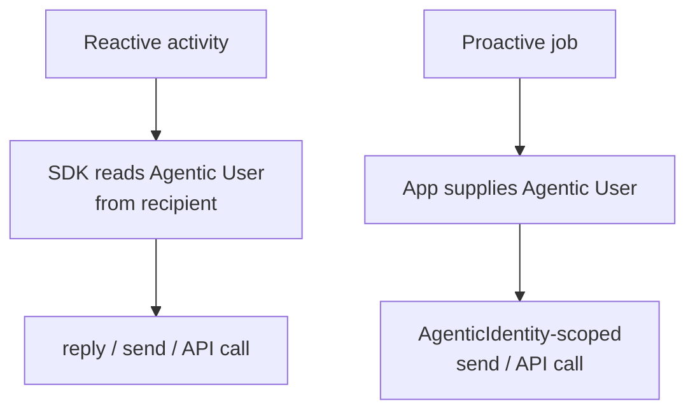

# Receiving and sending messages

Configure the blueprint client ID, credential, and tenant ID in your app's SDK credentials. Teams SDK uses them to acquire tokens for the Agentic User.

## Reactive messaging

An inbound Agent 365 activity includes the Agentic User in `activity.recipient`. The handler context automatically uses that identity for replies, sends, and API calls.

<LanguageInclude section="reactive" />

:::note Who sends the reply?
The example sends the reply as the Agentic User from the inbound activity, not as the blueprint. The blueprint authenticates the reusable runtime, but it isn't the conversational sender.
:::

## Bot capabilities

Most Teams capabilities available to standard bots are also available to Agentic Users, including cards, reactions, and API calls. For inbound activities, the handler's API client uses the Agentic User identity automatically.

This example adds a reaction to an incoming message as the Agentic User:

<LanguageInclude section="reaction" />

For more reaction options, see [Message Reactions](../message-reactions).

## Proactive messaging

A proactive operation has no inbound activity that identifies the sender. Create an `AgenticIdentity` associated with the Agentic User, then pass it as the operation scope.

If your app will send proactive messages later, store the conversation ID, service URL, Agentic App Instance ID, Agentic User ID, and tenant ID in persistent storage when it receives an activity.

<LanguageInclude section="proactive" />
